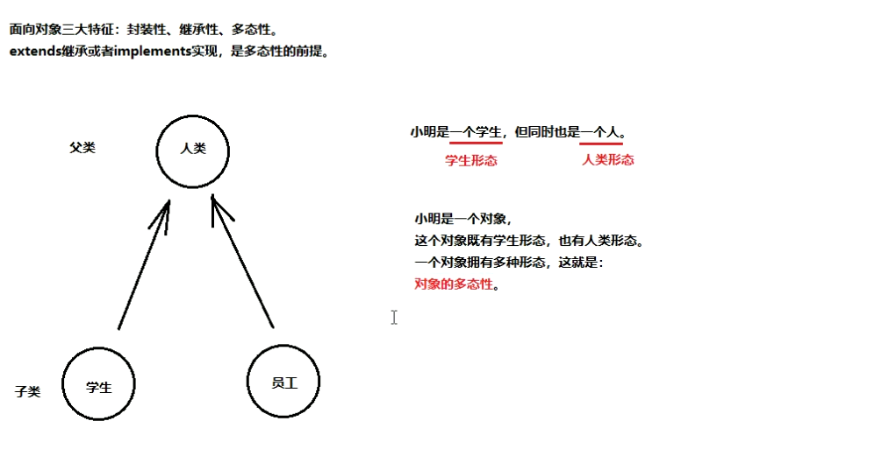
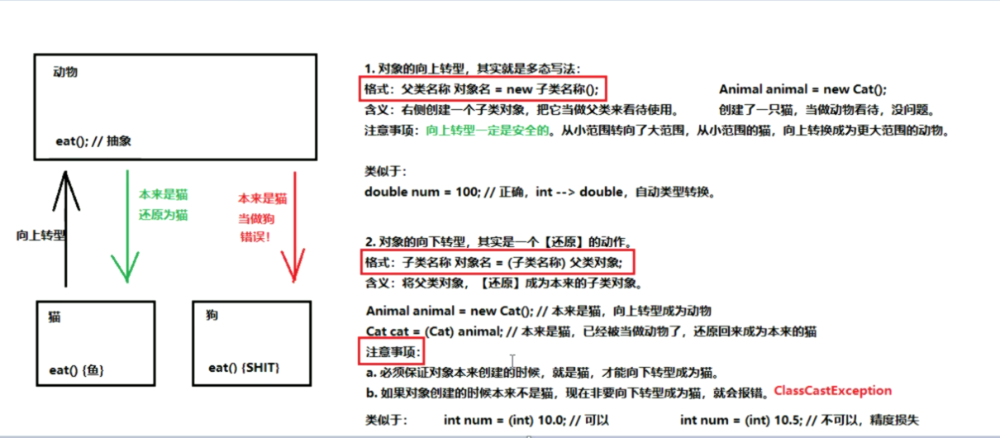

## 多态

##### 多态图解




##### 在代码中体现多态

> 父类名称 对象名 = new 子类名称();
>
> or
>
> 接口名称 对象名 = new 实现类名称();

```java
// 父类
public class Father {
    public void method(){
        System.out.println("parent class method call");
    }

    public void methodFather(){
        System.out.println("parent class specific method");  // 父类特有方法
    }
}

// 子类
public class Son extends Father{
    @Override
    public void method(){
        System.out.println("sub class method call");
    }
}

public class DemoMulti{
    public static void main(String[] args){
        // 使用多态写法，左侧父类的引用，指向了右侧子类的对象(类似于一只狗被当做了一只动物)
        Father son = new Son();
        son.method();  // sub class method call
        son.methodFather();  // parent class specific method
    }
}
```


##### 多态中成员变量的特点

访问成员变量的两种方式: 

1. 直接通过对象名访问成员变量: 看等号左边是谁, 优先用谁, 没有则向上找.
2. 间接通过成员方法访问成员变量: 看方法属于谁, 优先用谁, 没有则向上找.

口诀: 编译看右边, 运行还看右边

```java
// 父类
public class Father {
    String name = "Father";
    
    public String showName() {
        return this.name;
    }
}

// 子类
public class Son extends Father{
	String name = "Son";
    int age = 20;
    
    @Override
    public String showName() {  
        return this.name;
    }
}

public class DemoMulti{
    public static void main(String[] args){
        // 使用多态写法，左侧父类的引用，指向了右侧子类的对象(类似于一只狗被当做了一只动物)
        Father son = new Son();
        System.out.println(son.name);  // Father
        // System.out.println(son.age);  // 错误写法
        
        // 子类没有覆盖重写，就是父：Father
        // 子类有覆盖重写，就是子：Son
        System.out.println(son.showName());  // Son
    }
}
```


##### 多态中成员方法的特点

看 new 的是谁, 就优先用谁, 没有则向上找

口诀: 编译看左边, 运行看右边

```java
// 父类
public class Father {
    public void method(){
        System.out.println("parent class method call");
    }

    public void methodFather(){
        System.out.println("parent class specific method");  // 父类特有方法
    }
}

// 子类
public class Son extends Father{
    @Override
    public void method(){
        System.out.println("sub class method call");
    }
    
    public void methodSon(){
        System.out.println("son class specific method");  // 父类特有方法
    }
}

public class DemoMulti{
    public static void main(String[] args){
        Father son = new Son();  // 多态
        son.method();  // 父子都有，优先用子
        son.emthodFather();  // 子类没有，父类有，向上找到父类
        
        // son.methodSon();  // 错误写法
    }
}
```


##### 对象的转型




对象的向上转型:

向上转型有一个弊端: 对象一旦向上转型为父类, 那么就无法调用子类原本特有的内容.

猫是动物, 可以完成吃的动作, 可以抓老鼠, 但是如果向上转型为动物, 那么就不再拥有抓老鼠的动作, 因为动物类中没有抓老鼠的动作.

```java
public abstract class Animal {
    public abstract void eat();
}

public class Cat extends Animal{
    @Override
    public void eat(){
        System.out.println("cat eat fish");
    }
    
    public void catchMouse(){
        System.out.println("cat catches mouse");
    }
}

public class DemoTransition {
    public static void main(String[] args) {
        // 向上转型，就是父类引用 指向 子类对象
        Animal cat = new Cat();
        cat.eat();  // cat eat fish
        
        // cat.catchMouse();  // 错误写法
    }
}
```


向下转型:

```java
public abstract class Animal {
    public abstract void eat();
}

public class Cat extends Animal{
    @Override
    public void eat(){
        System.out.println("cat eat fish");
    }
    
    public void catchMouse(){
        System.out.println("cat catches mouse");
    }
}

public class DemoTransition {
    public static void main(String[] args) {
        // 对象的向上转型，就是父类引用 指向 子类对象
        Animal cat = new Cat();
        cat.eat();  // cat eat fish

        // cat.catchMouse();  // 错误写法
        // 向下转型，进行还原
        Cat transitionCat = (Cat) cat;
        transitionCat.catchMouse(); // cat catches mouse
    }
}
```

用 `instanceof` 关键字进行类型判断 ( 为了避免**向下**转型异常: `ClassCastException` )

```java
if (cat instanceof Cat){
    Cat transitionCat = (Cat) cat;
}
```


###### 完 !


