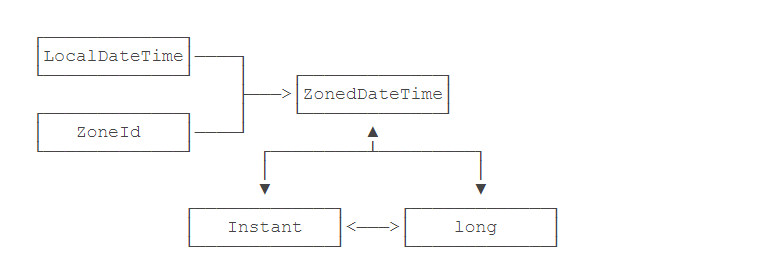

## 日期时间  <-->  时间戳

##### java.time 包提供的新的日期和时间API

1. LocalDateTime: 本地日期时间类
2. ZoneId: 时区类
3. ZonedDateTime: 带时区的日期时间类
4. Instant: 高精度时间戳
5. long: 长整型




##### LocalDateTime + ZoneId = ZonedDateTime

```java
import java.time.LocalDateTime;
import java.time.ZoneId;
import java.time.ZonedDateTime;

public class Main {
    public static void main(String[] args) {
        // 直接获取 ZonedDateTime 对象
        ZonedDateTime zdt1 = ZonedDateTime.now();
        System.out.println(zdt1);

        // LocalDateTime + ZoneId = ZonedDateTime
        LocalDateTime ldt = LocalDateTime.now();
        ZonedDateTime zdt2 = ldt.atZone(ZoneId.systemDefault());
        System.out.println(zdt2);
    }
}

运行结果:
2019-10-29T14:01:16.169741500+08:00[Asia/Shanghai]
2019-10-29T14:01:16.170744+08:00[Asia/Shanghai]
```


##### ZonedDateTime --> LocalDateTime 

```java
import java.time.LocalDateTime;
import java.time.ZonedDateTime;

public class Main {
    public static void main(String[] args) {
        // 直接获取 ZonedDateTime 对象
        ZonedDateTime zdt = ZonedDateTime.now();
        System.out.println(zdt);

        //转换为LocalDateTime时，直接丢弃了时区信息
        LocalDateTime ldt = zdt.toLocalDateTime();
        System.out.println(ldt);
    }
}

运行结果:
2019-10-29T14:00:13.876198+08:00[Asia/Shanghai]
2019-10-29T14:00:13.876198
```


##### ZonedDateTime -->  Instant  -->  long

```java
import java.time.Instant;
import java.time.ZonedDateTime;

public class Main {
    public static void main(String[] args) {
        // 直接获取 ZonedDateTime 对象
        ZonedDateTime zdt = ZonedDateTime.now();
        System.out.println(zdt);
        // to Instants
        Instant ins = zdt.toInstant();
        System.out.println(ins);
        // to long
        System.out.println(ins.toEpochMilli());
    }
}

运行结果:
2019-10-29T14:11:00.265786900+08:00[Asia/Shanghai]
2019-10-29T06:11:00.265786900Z
```


##### long  -->  Instant  -->  ZonedDateTime

```java
import java.time.Instant;
import java.time.ZoneId;
import java.time.ZonedDateTime;

public class Main {
    public static void main(String[] args) {
        // 获取 unix 毫秒值
        long insMilli = Instant.now().toEpochMilli();
        System.out.println(insMilli);

        // to Instant
        Instant ins = Instant.ofEpochMilli(insMilli);
        // to ZonedDateTime
        ZonedDateTime zdt = ZonedDateTime.ofInstant(ins, ZoneId.systemDefault());
        System.out.println(zdt);
    }
}

运行结果:
2019-10-29T14:25:50.986+08:00[Asia/Shanghai]
```


###### 完 !