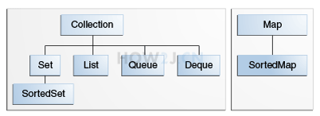

## Collection

### 定义

java.util 包提供了集合类: Collection, 它是**除 Map 外**所有其他集合类的根接口, java.util 包主要提供了以下三种类型的集合

- List: 一种有序列表的集合, 例如, 按索引排列的 Student 的 List
- Set: 一种保证没有重复元素的集合, 例如, 所有无重复名称的 Student 的 Set
- Map: 一种通过键值 (key-value) 查找的映射表集合, 例如, 根据 Student 的 name 查找对应 Student 的 Map

Java 集合的设计有几个特点: 

- 一是实现了 接口和实现类相分离, 例如, 有序表的接口是 List, 具体的实现类有 ArrayList, LinkedList 等

- 二是支持泛型, 我们可以限制在一个集合只能放入同一种数据类型的元素

  ```java
  List<String> list = new ArrayList<>(); //只能放入String类型的值
  ```


### 关系图




### 常用功能

最顶层的接口, 里边定义了所有单列集合共性的方法

单列集合子类可使用共性方法:

+ `public boolean add(E e)`：  在末尾添加一个元素。
+ `void add(int index, E e)`：在指定索引添加一个元素。
+ `public void clear()` :清空集合中所有的元素。
+ `public boolean remove(E e)`: 把给定的对象在当前集合中删除。
+ `public boolean contains(E e)`: 判断当前集合中是否包含给定的对象。
+ `public int indexOf(E e)`：返回某个元素的索引，如果元素不存在，就返回`-1`
+ `public boolean isEmpty()`: 判断当前集合是否为空。
+ `public int size()`: 返回集合中元素的个数。
+ `public Object[] toArray()`: 把集合中的元素，存储到数组中。

