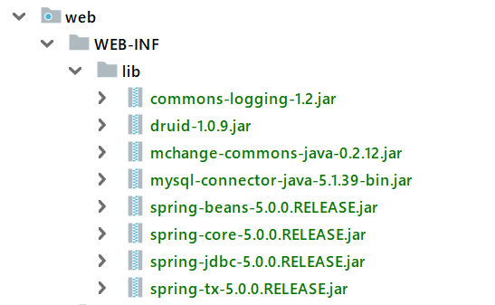

## Servlet

概念: 运行在服务器端的小程序

就是一个接口, 定义了 Java 类被浏览器访问到 ( 被tomcat识别 ) 的规则.

使用的时候, 自定义实现类, 实现 servlet 接口, 覆写方法就行


##### 快速使用

1. 创建 JavaEE 项目.

2. jar 包放在 web/WEB-INF/lib 目录下.

3. 定义一个类, 实现 Servlet 接口.

4. 实现接口中的所有抽象方法 ( 主要是 service 方法 )

   ```java
   @Override
   public void service(ServletRequest servletRequest, ServletResponse servletResponse) throws ServletException, IOException {
       System.out.println("hello world");
   }
   ```

5. 配置 Servlet:

   ```xml
   <!--配置 Servlet-->
   <servlet>
       <servlet-name>demo1</servlet-name>
       <servlet-class>com.web.Servlet_01_快速使用servlet</servlet-class>
   </servlet>
   
   <servlet-mapping>
       <servlet-name>demo1</servlet-name>
       <url-pattern>/demo1</url-pattern>
   </servlet-mapping>
   ```

6. 在浏览器中进行访问, service 方法被执行: 

   http://localhost:8080/demo1


##### jar 包存放路径

`web/WEB-INF/lib`: 只能是这种

 .


###### 完 !

