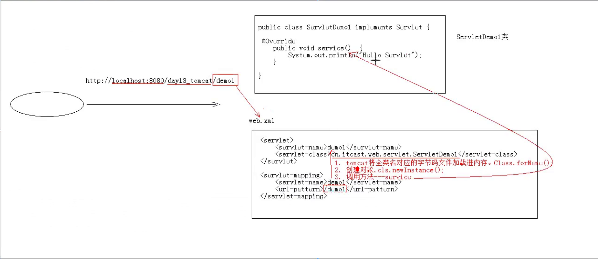

## Servlet 执行原理

执行原理: 

1. 当服务器接收到浏览器请求后, 会解析请求 URL 路径, 获取访问的 Servlet 的资源路径.
2. 查找 web.xml 文件, 是否有对应的 <url-pattern> 标签的内容.
3. 匹配到对应的 url 后, 则查找对应的 <servlet-class> 全类名.
4. tomcat 会将类的字节码文件加载进内存, 并且创建其对象.
5. 调用其方法.

图解: 

###### 完 !

