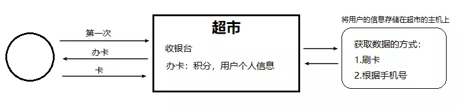

## session (主菜)

session: 服务端会话技术, 在一次会话的多次请求间共享数据, 将数据保存在服务端的对象 (HttpSession) 中.

session 依赖于 cookie


##### 特点

服务端技术, 将数据保存在服务器




##### 理解session

session 可以**减少**客户端和服务端之间的**数据传输量**, 同一个客户端每次和服务端交互时, 不需要每次都传回所有的 cookie 值, 而是**只传回一个 ID** , 客户端只要拿着这个ID就行了, 这个ID通常是名称叫做 JSESSIONID 的一个键值对. 


##### 基本操作

1. 获取 HttpSession 对象: 

   `HttpSession session = request.getSession()`

2. 使用 HttpSession 对象: 

   `Object getAttribute(String name)`

   `void setAttribute(String name, Object value)`

   `void removeAttribute(String name)`


##### 原理

服务端如何在一次会话中产生 Session 对象 ? 

1. 第一次访问服务端: 服务端创建 session 对象, 在 cookie 中设置 JSESSIONID = xxx

2. 下次访问服务端, 会携带 cookie 中的 JSESSIONID 从服务端获取到第一次创建的 session 对象.

   所以 getAttribute() 方法获取的 session 对象, 是同一个 session 对象.


##### 使用细节

1. 当客户端关闭后, 服务端不关闭, 两次获取 session 是否为同一个 ?

   + 默认情况下, 不是的 (因为浏览器关闭会导致 cookie 失效)

   + 如果需要 session 对象保持相同, 则设置 cookie 存活时间, 让 cookie 持久化保存

     ```java
     Cookie c = new Cookie("JSESSIONID", session.getId());
     c.setMaxAge(60*60);
     response.addCookie(c);
     ```

      

2. 客户端不关闭, 服务端关闭, 两次获取 session 是否为同一个 ?

   不是同一个, 但是要确保 session 数据不能丢失

   + session 的钝化: 在服务端正常关闭之前, 将 session 对象序列化到硬盘上.
   + session 的活化: 将 session 文件转化为内存中的 session 对象即可. ( tomcat 会自动完成, IDEA工具中暂时无法实现)

   

3. session 什么时候被销毁 ?

   1. session 对象调用 invalidate() 方法.

   2. tomcat session 对象默认失效时间: 30分钟

      修改 web.xml 文件, 可配置 session 的失效时间:

      ```xml
      <session-config>
          <session-timeout>30</session-timeout>
      </session-config>
      ```


##### 特点

1. session 用于存储一次会话的多次请求的数据, 存储在服务端.
2. session 可以存储任意类型, 任意大小的数据.


##### session 与 cookie 的区别

1. session 依赖于 cookie
2. session 存储在服务端, cookie 存储在客户端.
3. session 存储数据没有大小限制, cookie 有.
4. session 存储数据相对安全, cookie 相对不安全.


###### 完 ! 