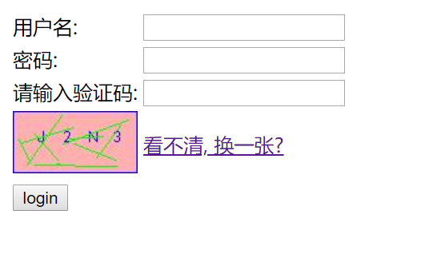

验证码登录案例 (将登录信息存储到 session)

##### 需求

1. 访问带有验证码的登录页面 login.jsp
2. 用户输入用户名, 密码以及验证码
   + 如果验证码输入有误, 则提示验证码错误, 跳转到登录页面,
   + 如果用户名和密码输入有误, 提示用户名或密码错误, 跳转到登录页面,
   + 如果全部输入正确, 则跳转到主页 loginSuccess.jsp, 显示: 用户名, 欢迎您!


##### 分析

1. 设置 request 的编码 ( post 字符流中文乱码问题 )

2. 获取参数 map 集合

3. 获取验证码

4. 将用户封装到 User 对象

5. 判断程序生成的验证码和用户输入的验证码是否一致

   从 session 中获取程序生成的验证码内容: 

   + 如果一致: 
     + 再判断用户名和密码是否正确:
       + 正确: 
         + 登录成功, 存储 session 数据
         + 跳转到 success 页面, 重定向: sendRedirect("/loginSuccess.jsp")
       + 不正确: 
         + 给出提示信息: 用户名或密码错误
         + 跳转登录页面 (请求转发)
   + 不一致:
     + 给用户提示信息: 验证码输入错误
     + 跳转到登录页面 (请求转发)

   

   ##### 实现

   login.jsp

   ```html
   <%@ page contentType="text/html;charset=UTF-8" language="java" %>
   <html>
   <head>
       <title>UserLogin</title>
       <style>
           span {
               color: red;
           }
       </style>
   </head>
   <body>
   
       <span><%= request.getAttribute("loginFailed") == null ? "": request.getAttribute("loginFailed")%></span>
       <span><%= request.getAttribute("imageCodeError") == null ? "":request.getAttribute("imageCodeError") %></span>
       <form action="/login2" method="post">
           <table>
               <tr>
                   <td>用户名:</td>
                   <td><input type="text" name="username"></td>
               </tr>
                           <tr>
                   <td>密码:</td>
                   <td><input type="password" name="passwd"></td>
               </tr>
               <tr>
                   <td>请输入验证码:</td>
                   <td><input type="text" name="imageCode"></td>
               </tr>
               <tr>
                   <td></td>
                   <td><a id="changeImageCode" href="">看不清, 换一张?</a></td>
               </tr>
               <tr>
                   <td><input type="submit" value="login"></td>
               </tr>
           </table>
       </form>
       <script>
           // 给 a 标签绑定事件
           var a = document.getElementById("changeImageCode");
           var img = document.getElementById("changeImageCode");
           // 绑定点击事件
           a.onclick = function(){
               // 加时间戳
               var snapshotTime = new Date().getTime();
               // img.src = "/image/code"  // 避免浏览器使用缓存
               img.src = "/image/code2?"+ snapshotTime
           }
       </script>
   </body>
   </html>
   ```

   效果图:

   .

   

   生成图片验证码 ( GenerateVerificationCode )

   ```java
   package com.web.Servlet_05_验证码登录案例.web;
   
   import javax.imageio.ImageIO;
   import javax.servlet.ServletException;
   import javax.servlet.annotation.WebServlet;
   import javax.servlet.http.HttpServlet;
   import javax.servlet.http.HttpServletRequest;
   import javax.servlet.http.HttpServletResponse;
   import javax.servlet.http.HttpSession;
   import java.awt.*;
   import java.awt.image.BufferedImage;
   import java.io.IOException;
   import java.util.Arrays;
   import java.util.Random;
   
   /**
    * 生成图片验证码, 并把验证码存储到 session
    */
   @WebServlet("/image/code2")
   public class GenerateVerificationCode extends HttpServlet {
       protected void doGet(HttpServletRequest request, HttpServletResponse response) throws ServletException, IOException {
           // 创建一个对象, 在内存中生成图片
           // 定义图片验证码的宽和高
           int width = 100;
           int height = 50;
           BufferedImage image = new BufferedImage(width, height, BufferedImage.TYPE_INT_BGR);
   
           // 美化图片
           Graphics g = image.getGraphics();  // 画笔对象
           g.setColor(Color.PINK);  // 设置画笔颜色
           g.fillRect(0, 0, width, height);  // 填充背景色
           g.setColor(Color.BLUE);
           g.drawRect(0, 0, width-1, height-1);  // 画边框
   
           // 画上随机字母数字
           // 定义数组, 将随机数字存储到数组中
           StringBuilder imageCode = new StringBuilder();
           String randomStr = "ABCDEFGHIJKLMNOPQRSTUVWXYZabcdefghijklmnopqrstuvwxyz0123456789";
           Random ran = new Random();
           for (int i = 1; i <= 4 ; i++) {
               int index = ran.nextInt(randomStr.length());
               String s = String.valueOf(randomStr.charAt(index));
               g.drawString(s, width / 5 * i, height / 2);
               imageCode.append(s);
           }
           // 存入到 session
           System.out.println(imageCode);
           HttpSession session = request.getSession();
           session.setAttribute("imageCode", imageCode.toString());
   
           // 画干扰线
           g.setColor(Color.GREEN);
           for (int i = 1; i <= 10 ; i++) {
               int x1 = ran.nextInt(width);
               int y1 = ran.nextInt(height);
               int x2 = ran.nextInt(width);
               int y2 = ran.nextInt(height);
               g.drawLine(x1, y1, x2, y2);
           }
   
           // 将图片验证码输出到浏览器
           ImageIO.write(image, "jpg", response.getOutputStream());
       }
   }
   ```

   

   登录处理 ( LoginServlet )  ( 为了简便, 里边的数据库操作可以换成字符串的判断, 太懒了, 没有改..)

   ```java
   /**
    * 用户登录的逻辑
    */
   @WebServlet("/login2")
   public class LoginServlet extends HttpServlet {
       protected void doPost(HttpServletRequest request, HttpServletResponse response) throws ServletException, IOException {
   //        // 校验 cookie, 是否登录过
   //        Cookie[] cookies = request.getCookies();
   //        // 拿出 session 中的 imageCode 进行比较
   //        HttpSession session = request.getSession();
   //        for (Cookie cookie : cookies) {
   //            String value = cookie.getValue();
   //            // 如果在 cookie 中有 username 的值, 并且session中存在
   //            String isLogin = (String) session.getAttribute(value);
   //            if (isLogin != null) {
   //                // 登录过, 直接跳转 loginSuccess.jsp
   //                response.sendRedirect("/loginSuccess.jsp");
   //            }
   //        }
   
           // 为解除中文参数乱码问题, 设置 request 的字符流编码
           request.setCharacterEncoding("utf-8");
           // 比较验证码
           String imageCode = request.getParameter("imageCode");
           HttpSession session = request.getSession();
           String imageCodeSession = String.valueOf(session.getAttribute("imageCode"));
           // 从 session 中获取图片验证码之后, 立即删除
           session.removeAttribute("imageCode");
           if (imageCodeSession != null && imageCodeSession.equalsIgnoreCase(imageCode)) {
               // 再判断用户名和密码, 将参数封装到对应的 javabean 中
               Map<String, String[]> map = request.getParameterMap();
               User loginUser = new User();
               try {
                   BeanUtils.populate(loginUser, map);
               } catch (IllegalAccessException e) {
                   e.printStackTrace();
               } catch (InvocationTargetException e) {
                   e.printStackTrace();
               }
               // 校验用户名及密码
               User user = new UserDao().login(loginUser.getUsername(), loginUser.getPasswd());
               if (user != null) {
                   // 登录成功, 保存session, 设置 cookie, 跳转到首页
                   session.setAttribute(loginUser.getUsername(), loginUser.getPasswd());
                   Cookie cookie = new Cookie("username", loginUser.getUsername());
                   cookie.setMaxAge(20);
                   response.addCookie(cookie);
                   response.sendRedirect("/loginSuccess.jsp");
               } else {
                   // 登录失败, 跳转到登录页面, 提示用户名或密码错误
                   request.setAttribute("loginFailed", "用户名或密码错误");
                   request.getRequestDispatcher("/login.jsp").forward(request, response);
               }
           } else {
               // 跳转到登录页面, 提示验证码输入错误
               request.setAttribute("imageCodeError", "验证码输入错误");
               request.getRequestDispatcher("/login.jsp").forward(request, response);
           }
       }
   
       protected void doGet(HttpServletRequest request, HttpServletResponse response) throws ServletException, IOException {
   
       }
   }
   ```

   

   登录成功 jsp 页面 ( loginSuccess.jsp)

   ```html
   <%@ page contentType="text/html;charset=UTF-8" language="java" %>
   <html>
     <head>
       <title>$Title$</title>
     </head>
     <body>
         <%-- 从 cookie 中拿到登录用户的 username --%>
         <%
             String username = "";
             Cookie[] cookies = request.getCookies();
             for (Cookie cookie : cookies) {
                 if ("username".equals(cookie.getName())){
                     username = cookie.getValue();
                     break;
                 }
             }
         %>
         <%--如果 username 存在, 那么显示欢迎, 否则提示用户重新登录 (cookie过期)--%>
         <%= username != "" ? "<h3>欢迎您, " + username + "</h3>":
                 "cookie 已过期, 请重新登录: localhost:8080/login.jsp"%>
     </body>
   </html>
   ```

   

   

   ###### 完 !

   

