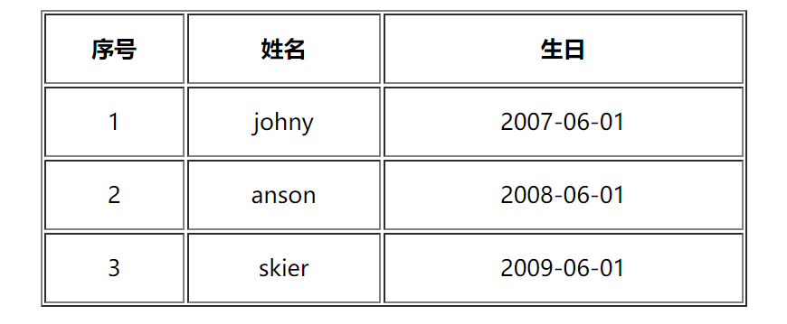

## jsp 展示用户信息案例

##### 需求

在 request 对象域中有一个存有 User 对象的 List 集合, 需要在 jsp 页面中以 table 表格标签的形式展示, 结合 EL 表达式 + JSTL常用标签来实现.


##### 分析

User : 编写一个标准的 JavaBean User 类, 提供一个全参的构造方法.

jsp 页面: 

1. 创建 List 集合, new N 个 User 对象, 放入List集合中.
2. 编写 table 标签, 表头 <th> , 表行 <tr>  使用 JSTL 中的 forEach 进行数据的展示


##### 细节

表格居中, 设置边框, 居中 : <table border="1", width="500" align="center">

th, td 标签设置高度, 文字居中 :  <th height="50" align="center">序号</th>


##### 实现

User

```java
package com.web;
import java.text.SimpleDateFormat;
import java.util.Date;

public class User {
    private int id;
    private String username;
    private Date birthday;

	// setter and getter + 全参构造方法

    public String getBirthday() {
        SimpleDateFormat formater = new SimpleDateFormat("yyyy-MM-dd");
        return formater.format(this.birthday);
    }
	...
}

```


jsp 页面

```jsp
<%@ page import="com.web.User" %>
<%@ page import="java.text.DateFormat" %>
<%@ page import="java.text.SimpleDateFormat" %>
<%@ page import="java.util.ArrayList" %>
<%@ page import="java.util.List" %>
<%@ page contentType="text/html;charset=UTF-8" language="java" %>
<%@taglib prefix="c" uri="http://java.sun.com/jsp/jstl/core" %>
<html>
<head>
    <title>用户信息展示</title>
</head>
<body>
    <%
        DateFormat dateFormat1 = new SimpleDateFormat("yyyy-MM-dd");
        User user1 = new User(1, "johny", dateFormat1.parse("2007-06-01"));
        User user2 = new User(2, "anson", dateFormat1.parse("2008-06-01"));
        User user3 = new User(3, "skier", dateFormat1.parse("2009-06-01"));
        List list = new ArrayList<User>();
        list.add(user1);
        list.add(user2);
        list.add(user3);
        // 设置到 request 对象域中
        request.setAttribute("list", list);
    %>

    <table border="1", width="500" align="center">
        <tr>
            <th height="50" align="center">序号</th>
            <th>姓名</th>
            <th>生日</th>
        </tr>
        <c:forEach items="${requestScope.list}" var="user" varStatus="s">
            <tr>
                <td height="50" align="center">${user.id}</td>
                <td align="center">${user.username}</td>
                <td align="center">${user.birthday}</td>
            </tr>
        </c:forEach>

    </table>

</body>
</html>
```


##### 效果图




###### 完 ! 