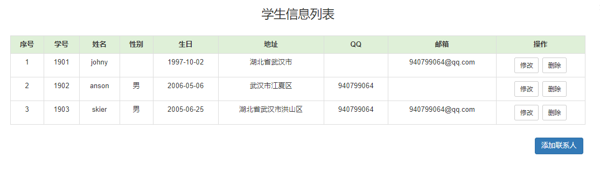
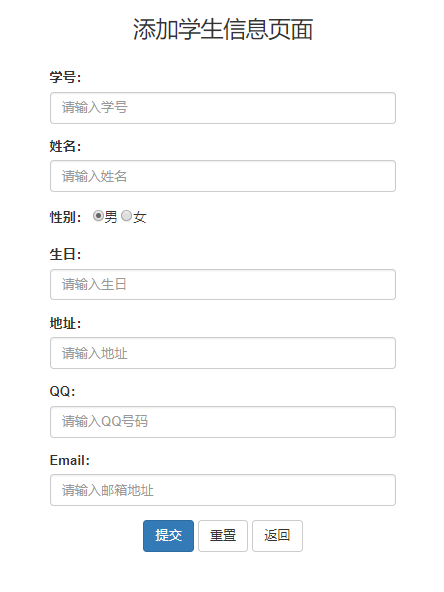
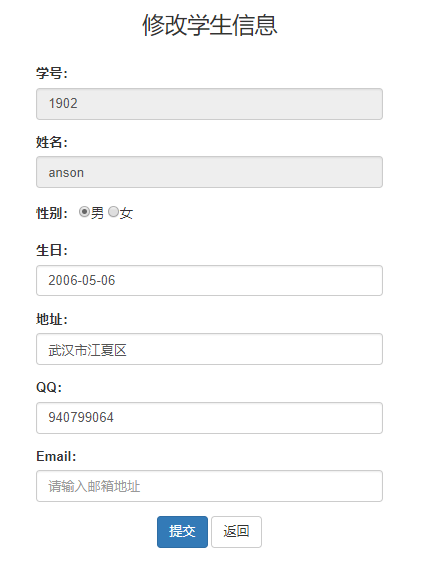

## 学生信息管理系统小结

> 周末拿最近学习的知识 (JDBC, Servlet, JSP) 做一个小案例, 本来周末就应该整理笔记的, 但是打球也不能耽误啊, 所以趁今天下班的时间, 做下记录.

### 技术准备

1. Java 基础知识, JavaEE 基础

   tomcat, servlet, jsp(EL + JSTL)

2. web前端的基础知识

   html, css,  javascript基础 + Jquery 基础

3. 关系型数据库

   使用 SprintJDBC 操作 mysql

4. 开发工具

   IDEA, JDK8.0


### 需求分析

1. 使用 mysql 来存储学生信息
2. 页面上完成学生数据的展示, 可进行学生信息的增删改差, 然后支持上一页, 下一页操作, 以及学生信息查询.


### 实现

#### 一. 表结构设计

+ 创建数据库: student

  将编码设置为 utf-8, 便于存取中文

  ```sql
  drop database if exists student;
  create database student default charset=utf8;
  ```

+ 创建表: student

  ```sql
  create table student(
      id int unsigned primary key auto_increment not null,
      student_id varchar(20) not null unique COMMENT '学号',
      name varchar(20) not null,
      gender varchar(5),
      birthday date, 
      address varchar(50),
      qq varchar(20),
      email varchar(50)
  ) ENGINE=InnoDB DEFAULT CHARSET=utf8;
  ```

  > 设置student_id的原因是因为学号可能会改变, 而主键 id 无法修改.


#### 二. 创建JavaEE项目, 导入 jar 包

项目结构图如下: 

.

#### 三. 准备前端页面 (原型设计)

在项目中就是前端的 html 代码, 这一步也非常的重要.

> 首页以列表的形式展示学生信息
>
> 新增 和 修改信息页面, 这两个页面应该长的很像

如果把新增和修改看成一个页面, 那么一共就两个页面 ~ 

##### 学生信息列表



##### 添加学生页面

.

##### 编辑学生页面

.


#### 四. src目录层次结构

代码模块的划分:

1. 实体类: student  (就一张学生表, 所以对应的实体类只有一个)
2. 数据访问对象: dao  (操作学生对象的 StudentDao)
3. 逻辑处理: Servlet  (学生信息列表展示, 新增, 修改, 删除学生信息)
4. 工具类: JDBCDruidUtils  (封装了 SpringJDBC 对数据库的操作)
5. 单元测试: test

在 src 目录下创建代码的层次结构:

.


#### 五. 具体代码逻辑实现

##### student 实体类

```java
package com.student.entity;

import java.text.ParseException;
import java.text.SimpleDateFormat;
import java.util.Date;

public class Student {
    private int id;
    private String studentId;
    private String name;
    private String gender;
    private Date birthday;
    private String address;
    private String qq;

    // setter and getter ,  日期类型需要额外转换下
    
    public String getBirthday() {
        SimpleDateFormat formater = new SimpleDateFormat("yyyy-MM-dd");
        return formater.format(this.birthday);
    }

    public void setBirthday(String birthday) {
        SimpleDateFormat formater = new SimpleDateFormat("yyyy-MM-dd");
        Date date = null;
        try {
            date = formater.parse(birthday);
        } catch (ParseException e) {
            e.printStackTrace();
        }
        this.birthday = date;
    }
}

```


##### JDBCDruidUtils 连接池:

```java
package com.student.utils;

import com.alibaba.druid.pool.DruidDataSourceFactory;
import javax.sql.DataSource;
import java.io.InputStream;
import java.sql.Connection;
import java.sql.PreparedStatement;
import java.sql.ResultSet;
import java.sql.SQLException;
import java.util.Properties;

/**
 * JDBCDruidUtils 工具类
 */
public class JDBCDruidUtils {
    private static DataSource ds = null;

    static {
        try {
            // 加载配置文件
            Properties pro = new Properties();
            // 获取 src 路径下的文件 --> ClassLoader
            ClassLoader cl = JDBCDruidUtils.class.getClassLoader();
            InputStream is = cl.getResourceAsStream("druid.properties");
            pro.load(is);
            // 通过工厂函数 获取 数据库连接池 (传入配置文件)
            ds = DruidDataSourceFactory.createDataSource(pro);

        } catch (Exception e) {
            e.printStackTrace();
        }
    }

    // 获取连接池对象
    public static DataSource getDataSource(){
        return ds;
    }

    // 获取连接对象
    public static Connection getConnection() throws SQLException {
        return ds.getConnection();
    }
}
```


##### druid.properties 配置文件

```properties
driverClassName=com.mysql.jdbc.Driver
# useUnicode表示允许使用自定义的Unicode
url=jdbc:mysql://192.168.0.115:3306/JDBC?useUnicode=true&characterEncoding=utf8
username=username
password=password
initialSize=5
maxActive=10
maxWait=3000
```


##### studentDao

> DAO (Data Access Object) 数据库访问, 就是对数据库的操作进行封装, 让 servlet 里边看不到 JDBC 的代码

```java
package com.student.dao;

import com.student.entity.Student;
import com.student.utils.JDBCDruidUtils;
import org.springframework.jdbc.core.BeanPropertyRowMapper;
import org.springframework.jdbc.core.JdbcTemplate;

/**
 * student 对象相关的操作方法
 */
public class StudentDao {
    // 获取 JdbcTemplate 对象
    private static JdbcTemplate template = new JdbcTemplate(JDBCDruidUtils.getDataSource());

    /**
     * 获取 JdbcTemplate 对象, 将学生信息写入到数据库中
     */
    public static int createStudent(Student student){
        String createSql = "insert into student values(?,?,?,?,?,?,?,?);";
        int num = StudentDao.template.update(createSql, student.getId(), student.getStudentId(), student.getName(),
                student.getGender(), student.getBirthday(), student.getAddress(), student.getQq(), student.getEmail());
        return num;
    }

    /**
     * 通过id查询学生
     * @param id
     * @return
     */
    public static Student queryStudentById(String id){
        String querySql = "select * from student where id = ?";
        Student student = StudentDao.template.queryForObject(querySql, new BeanPropertyRowMapper<Student>(Student.class), id);
        return student;
    }


    /**
     * 更新 学生信息
     * @param student
     * @return
     */
    public static int updateStudent(Student student){
        String updateSql = "update student set gender = ?, birthday = ?, address = ?," +
                           "qq = ?, email = ? where id = ?;";
        int num = StudentDao.template.update(updateSql, student.getGender(), student.getBirthday(), student.getAddress(),
                student.getQq(), student.getEmail(), student.getId());
        return num;
    }

    /**
     * 删除学生信息
     * @param id
     * @return
     */
    public static int deleteStudentById(String id){
        String deleteSql = "delete from student where id = ?";
        int num = StudentDao.template.update(deleteSql, id);
        return num;
    }
}
```


##### 学生列表展示

```java
package com.student.servlet;

import com.student.utils.JDBCDruidUtils;
import org.springframework.jdbc.core.JdbcTemplate;
import javax.servlet.ServletException;
import javax.servlet.annotation.WebServlet;
import javax.servlet.http.HttpServlet;
import javax.servlet.http.HttpServletRequest;
import javax.servlet.http.HttpServletResponse;
import javax.sql.DataSource;
import java.io.IOException;
import java.util.List;
import java.util.Map;

@WebServlet("/list")
public class ReadList extends HttpServlet {
    protected void doPost(HttpServletRequest request, HttpServletResponse response) throws ServletException, IOException {
        // 不用获取参数, 所以不用设置流的编码
            // 获取 JdbcTemplate 对象
        DataSource ds  = JDBCDruidUtils.getDataSource();
        JdbcTemplate template = new JdbcTemplate(ds);

        // 查询结果, 将结果集封装为 ReadList 集合
//        String querySql = "select * from student limit 0, 3";
        String querySql = "select * from student";
        java.util.List<Map<String, Object>> studentList = template.queryForList(querySql);
        // 将学生对象列表存储到 request 对象域中
        request.setAttribute("studentList", studentList);
        // 转发到 list 页面
        request.getRequestDispatcher("/list.jsp").forward(request, response);
    }
}

```

jsp 页面

```jsp
<%@ page contentType="text/html;charset=UTF-8" language="java" %>
<%@taglib prefix="c" uri="http://java.sun.com/jsp/jstl/core" %>
<!DOCTYPE html>
<html lang="zh-CN">
<head>
    <meta charset="utf-8">
    <!-- 使用Edge最新的浏览器的渲染方式 -->
    <meta http-equiv="X-UA-Compatible" content="IE=edge">
    <!-- viewport视口：网页可以根据设置的宽度自动进行适配，在浏览器的内部虚拟一个容器，容器的宽度与设备的宽度相同。
    width: 默认宽度与设备的宽度相同
    initial-scale: 初始的缩放比，为1:1 -->
    <meta name="viewport" content="width=device-width, initial-scale=1">
    <!-- 上述3个meta标签*必须*放在最前面，任何其他内容都*必须*跟随其后！ -->
    <title>学生信息管理系统</title>
    <!-- 1. 导入CSS的全局样式 -->
    <link href="css/bootstrap.min.css" rel="stylesheet">
    <!-- 2. jQuery导入，建议使用1.9以上的版本 -->
    <script src="js/jquery-2.1.0.min.js"></script>
    <!-- 3. 导入bootstrap的js文件 -->
    <script src="js/bootstrap.min.js"></script>
    <style type="text/css">
        td, th {
            text-align: center;
        }
    </style>
</head>
<body>
<div class="container">
    <h3 style="text-align: center">学生信息列表</h3>
    <br>
    <form id="form" action="${pageContext.request.contextPath}/delete" method="post">
        <table border="1" class="table table-bordered table-hover">
        <tr class="success">
            <%--<th><input type="checkbox" id="firstCb"></th>--%>
            <th>序号</th>
            <th>学号</th>
            <th>姓名</th>
            <th>性别</th>
            <th>生日</th>
            <th>地址</th>
            <th>QQ</th>
            <th>邮箱</th>
            <th>操作</th>
        </tr>

        <c:forEach items="${requestScope.studentList}" var="student" varStatus="s">
            <tr>
                <%--<td><input type="checkbox" name="uid" value="${student.id}"></td>--%>
                <td>${s.count}</td>
                <td>${student.student_id}</td>
                <td>${student.name}</td>
                <td>${student.gender}</td>
                <td>${student.birthday}</td>
                <td>${student.address}</td>
                <td>${student.qq}</td>
                <td>${student.email}</td>
                <td><a class="btn btn-default btn-sm" href="${pageContext.request.contextPath}/update?id=${student.id}">修改</a>&nbsp;
                    <a class="btn btn-default btn-sm" href="javascript:deleteStudent(${student.id});">删除</a></td>
            </tr>

        </c:forEach>
    </table>
    </form>

    <div style="float: right;margin: 5px;">
        <a class="btn btn-primary" href="${pageContext.request.contextPath}/create.jsp">添加联系人</a>
    </div>

</div>
    <script>
        function deleteStudent(id){
            //用户安全提示
            if(confirm("您确定要删除吗？")){
                //访问路径
                location.href="${pageContext.request.contextPath}/delete?id="+id;
                location.submit();
            }
        }
    </script>
</body>
</html>
```


##### 新增一条学生信息

> 先返回新增学生信息的 jsp 页面, 然后用户在键入信息之后, 提交表单到后端处理.

```java
package com.student.servlet;

import com.student.dao.StudentDao;
import com.student.entity.Student;
import java.io.IOException;
import java.util.Map;
import javax.servlet.ServletException;
import javax.servlet.annotation.WebServlet;
import javax.servlet.http.HttpServlet;
import javax.servlet.http.HttpServletRequest;
import javax.servlet.http.HttpServletResponse;

@WebServlet("/create")
public class Create extends HttpServlet {
    protected void doPost(HttpServletRequest request, HttpServletResponse response) throws ServletException, IOException {
        // 获取参数, 设置流的编码
        request.setCharacterEncoding("utf-8");
        // 将参数封装到 map 集合中 (使用JavaBeanUtils工具)
        Map<String, String[]> map = request.getParameterMap();
        Student student = StudentDao.mapToStudent(map);

        // 获取 JdbcTemplate 对象, 将学生信息写入到数据库中
        int num = StudentDao.create(student);
        // 重定向到 list 页面
        response.sendRedirect(request.getContextPath() + "/list");
    }
}

```

jsp 页面

```jsp
<%@ page contentType="text/html;charset=UTF-8" language="java" %>
<!DOCTYPE html>
<html lang="zh-CN">
<head>
    <meta charset="utf-8">
    <!-- 使用Edge最新的浏览器的渲染方式 -->
    <meta http-equiv="X-UA-Compatible" content="IE=edge">
    <!-- viewport视口：网页可以根据设置的宽度自动进行适配，在浏览器的内部虚拟一个容器，容器的宽度与设备的宽度相同。
    width: 默认宽度与设备的宽度相同
    initial-scale: 初始的缩放比，为1:1 -->
    <meta name="viewport" content="width=device-width, initial-scale=1">
    <!-- 上述3个meta标签*必须*放在最前面，任何其他内容都*必须*跟随其后！ -->
    <title>添加学生信息</title>
    <!-- 1. 导入CSS的全局样式 -->
    <link href="css/bootstrap.min.css" rel="stylesheet">
    <!-- 2. jQuery导入，建议使用1.9以上的版本 -->
    <script src="js/jquery-2.1.0.min.js"></script>
    <!-- 3. 导入bootstrap的js文件 -->
    <script src="js/bootstrap.min.js"></script>
</head>
<body>
<div class="container" style="width: 400px;">
    <h3 style="text-align: center">添加学生信息页面</h3>
    <br>
    <form action="${pageContext.request.contextPath}/create" method="post">
        <div class="form-group">
            <label for="studentId">学号：</label>
            <input type="text" class="form-control" id="studentId" name="studentId" placeholder="请输入学号">
        </div>
        <div class="form-group">
            <label for="name">姓名：</label>
            <input type="text" class="form-control" id="name" name="name" placeholder="请输入姓名">
        </div>
        <div class="form-group">
            <label>性别：</label>
            <input type="radio" name="gender" value="男" checked="checked"/>男
            <input type="radio" name="gender" value="女"/>女
        </div>
        <div class="form-group">
            <label for="birthday">生日：</label>
            <input type="text" class="form-control" id="birthday" name="birthday" placeholder="请输入生日">
        </div>
        <div class="form-group">
            <label for="address">地址：</label>
            <input type="text" class="form-control" id="address" name="address" placeholder="请输入地址"/>
        </div>
        <div class="form-group">
            <label for="qq">QQ：</label>
            <input type="text" class="form-control" id="qq" name="qq" placeholder="请输入QQ号码"/>
        </div>
        <div class="form-group">
            <label for="email">Email：</label>
            <input type="text" class="form-control" id="email" name="email" placeholder="请输入邮箱地址"/>
        </div>
        <div class="form-group" style="text-align: center">
            <input class="btn btn-primary" type="submit" value="提交" />
            <input class="btn btn-default" type="reset" value="重置" />
            <input class="btn btn-default" type="button" value="返回" id="getBack"/>
        </div>
    </form>
</div>
<script>
    //给返回按钮添加单击事件, 返回上一个页面
    document.getElementById("getBack").onclick = function(){
         window.history.back(-1);
    };
</script>
</body>
</html>
```


##### 更新学生信息

> get 方法中返回编辑学生信息的 jsp 页面, 填充当前学生的信息
>
> post 方法对用户提交的 form 表单, 对学生信息进行更新

```java
package com.student.servlet;

import java.io.IOException;
import java.lang.reflect.InvocationTargetException;
import java.util.Map;
import com.student.dao.StudentDao;
import com.student.entity.Student;
import org.apache.commons.beanutils.BeanUtils;
import javax.servlet.ServletException;
import javax.servlet.annotation.WebServlet;
import javax.servlet.http.HttpServlet;
import javax.servlet.http.HttpServletRequest;
import javax.servlet.http.HttpServletResponse;


@WebServlet("/update")
public class Update extends HttpServlet {
    protected void doPost(HttpServletRequest request, HttpServletResponse response) throws ServletException, IOException {
        // 获取参数, 设置流的编码
        request.setCharacterEncoding("utf-8");
        // 将参数封装到 map 集合中 (使用JavaBeanUtils工具)
        Map<String, String[]> map = request.getParameterMap();
        Student student = new Student();
        try {
            BeanUtils.populate(student, map);
        } catch (IllegalAccessException e) {
            e.printStackTrace();
        } catch (InvocationTargetException e) {
            e.printStackTrace();
        }
        // 获取 JdbcTemplate 对象, 将学生信息更新到数据库中
        int num = StudentDao.updateStudent(student);
        System.out.println("更新成功, num: " + num);
        // 重定向到 list 页面
        response.sendRedirect(request.getContextPath() + "/list");
    }

    // 返回带有 student 信息的修改页面
    protected void doGet(HttpServletRequest request, HttpServletResponse response) throws ServletException, IOException {
        // 获取student的 id
        String id = request.getParameter("id");
        Student student = StudentDao.queryStudentById(id);
        // 将需要修改的学生信息放到 request 域对象中
        request.setAttribute("student", student);
        // 请求转发到 update.jsp 页面
        request.getRequestDispatcher("/update.jsp").forward(request, response);
    }
}
```

jsp页面

```jsp
<%@ page contentType="text/html;charset=UTF-8" language="java" %>
<%@taglib prefix="c" uri="http://java.sun.com/jsp/jstl/core" %>
<!DOCTYPE html>
<html lang="zh-CN">
    <head>
        <meta charset="utf-8">
        <meta http-equiv="X-UA-Compatible" content="IE=edge">
        <meta name="viewport" content="width=device-width, initial-scale=1">
        <title>修改学生信息</title>
        <link href="css/bootstrap.min.css" rel="stylesheet">
        <script src="js/jquery-2.1.0.min.js"></script>
        <script src="js/bootstrap.min.js"></script>
        
    </head>
    <body>
        <div class="container" style="width: 400px;">
        <h3 style="text-align: center;">修改学生信息</h3>
            <br>
        <form action="${pageContext.request.contextPath}/update" method="post">
            <!--  隐藏域 提交id-->
            <input type="hidden" name="id" value="${requestScope.student.id}">
          <div class="form-group">
            <label for="studentId">学号：</label>
            <input type="text" class="form-control" id="studentId" name="studentId"  value="${requestScope.student.studentId}" readonly="readonly" placeholder="请输入学号" />
          </div>

          <div class="form-group">
            <label for="name">姓名：</label>
            <input type="text" class="form-control" id="name" name="name"  value="${requestScope.student.name}" readonly="readonly" placeholder="请输入姓名" />
          </div>

          <div class="form-group">
            <label>性别：</label>
              <c:if test="${requestScope.student.gender == '男'}">
                  <input type="radio" name="gender" value="男" checked />男
                  <input type="radio" name="gender" value="女"  />女
              </c:if>

              <c:if test="${requestScope.student.gender == '女'}">
                  <input type="radio" name="gender" value="男"  />男
                  <input type="radio" name="gender" value="女" checked  />女
              </c:if>
          </div>

          <div class="form-group">
            <label for="birthday">生日：</label>
            <input type="text" class="form-control" value="${requestScope.student.birthday}" id="birthday"  name="birthday" placeholder="请输入生日" />
          </div>

          <div class="form-group">
            <label for="address">地址：</label>
            <input type="text" id="address" class="form-control" value="${requestScope.student.address}" name="address" placeholder="请输入地址"/>
          </div>
          <div class="form-group">
            <label for="qq">QQ：</label>
            <input type="text" id="qq" class="form-control" value="${requestScope.student.qq}" name="qq" placeholder="请输入QQ号码"/>
          </div>
          <div class="form-group">
            <label for="email">Email：</label>
            <input type="text" id="email" class="form-control" value="${requestScope.student.email}" name="email" placeholder="请输入邮箱地址"/>
          </div>
         <div class="form-group" style="text-align: center">
            <input class="btn btn-primary" type="submit" value="提交" />
            <%--<input class="btn btn-default" type="reset" value="重置" />--%>
            <input class="btn btn-default" type="button" value="返回" id="getBack"/>
         </div>
        </form>
    </div>
    <script>
    //给返回按钮添加单击事件, 返回上一个页面
    document.getElementById("getBack").onclick = function(){
         window.history.back(-1);
    };
    </script>
</body>
</html>
```


##### 删除学生信息

> 写到这里, 删除的逻辑就非常简单了, 需要注意的是, 删除的时候, 需要给用户弹框确认, 这部分涉及到前端 js 的一个知识点.
>
> ```js
> function deleteStudent(id){
>     //用户安全提示
>     if(confirm("您确定要删除吗？")){				             								location.href="${pageContext.request.contextPath}/delete?id="+id; 						location.submit();
>     }
> }
> ```

```java
package com.student.servlet;

import com.student.dao.StudentDao;
import com.student.entity.Student;
import java.io.IOException;
import javax.servlet.ServletException;
import javax.servlet.annotation.WebServlet;
import javax.servlet.http.HttpServlet;
import javax.servlet.http.HttpServletRequest;
import javax.servlet.http.HttpServletResponse;


@WebServlet("/delete")
public class Delete extends HttpServlet {
    protected void doGet(HttpServletRequest request, HttpServletResponse response) throws ServletException, IOException {
        // 获取student的 id
        String id = request.getParameter("id");
        int num = StudentDao.deleteStudentById(id);
        System.out.println("删除学生信息, num: " + num);
        // 重定向到 list 页面
        response.sendRedirect(request.getContextPath() + "/list");
    }
}

```


### 案例总结

1. 一共花了 6 个小时左右的时间, 后端的逻辑处理不算复杂, 知识点忘记了可以看下前边学习的笔记, 总的来说还算顺利.
2. 前端的页面布局是资料里边找的模板, 然后改了一些, 能够配合后端的 api 进行数据交互, 然后运用 jsp 中的 EL 表达式和 JSTL 标签进行展示, 没有涉及到一些很难的内容.
3. 这是一个前后端不分离的案例, 和之前学习的 python  flask 项目里边的 jinja2  模板引擎非常的相似, 例如大胡子语法( {{}} ), 控制代码块( if else, for 循环 ), 过滤器, 模板继承等内容, 有之前的项目经验, 理解起来也比较的容易.


### 案例改进

写到这里, 还是一个非常粗糙的案例, 可以优化的点有: 

1. 新增, 修改学生信息时对参数进行校验,
2. 按学号, 姓名, 性别进行检索, 
3. 分页查询,
4. 批量删除,
5. 登录功能,
6. 权限管理 (分管理员, 普通用户等, 普通用户没有删除功能)

> 后边有时间再持续优化 ~  (也许就这么一说,  haha)


最后, 附上github仓库地址: https://github.com/kaichenkai/StudentManagement


###### 完 !