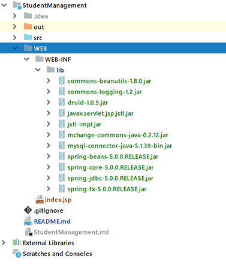
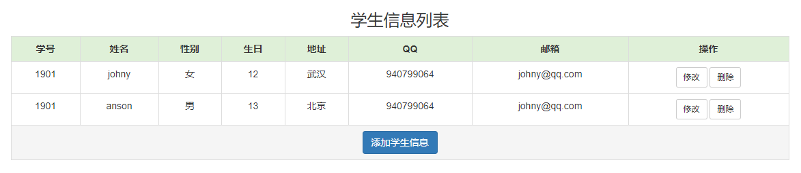
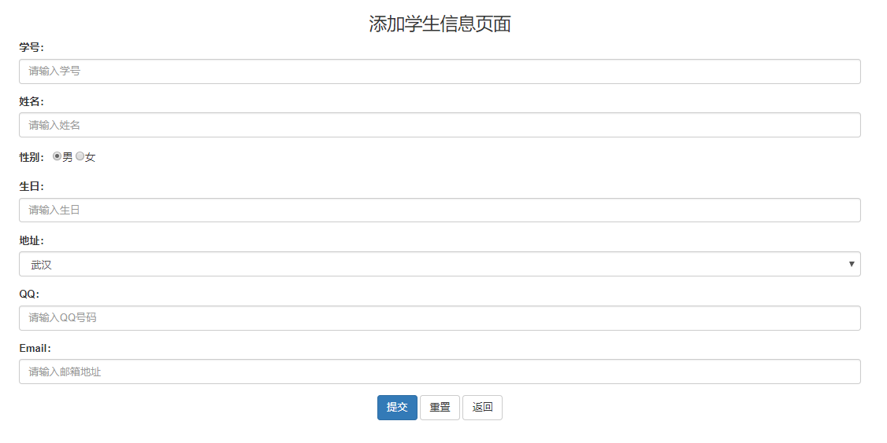
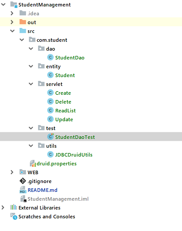

## 学生信息管理系统

### 需求

页面上完成学生数据的展示, 可进行学生信息的增删改差, 可以的话, 支持上一页, 下一页操作, 以及学生信息查询


### 分析

所应用的技术点: 

1. Tomcat server
2. Servlet
3. jsp 页面
4. Mysql数据库
5. 数据库操作: SpringJDBC + Druid连接池
6. BeanUtils: 完成数据封装 (反序列化)


### 实现

#### 一. 表结构设计

+ 创建数据库: student

  将编码设置为 utf-8, 便于存取中文

  ```sql
  drop database if exists student;
  create database student default charset=utf8;
  ```

+ 创建表: student

  ```sql
  create table student(
      id int unsigned primary key auto_increment not null,
      student_id varchar(20) not null unique COMMENT '学号',
      name varchar(20) not null,
      gender varchar(5),
      birthday date, 
      address varchar(50),
      qq varchar(20),
      email varchar(50)
  ) ENGINE=InnoDB DEFAULT CHARSET=utf8;
  ```

  > 设置student_id的原因是因为学号可能会改变, 而主键 id 无法修改.


#### 二. 创建JavaEE项目, 导入 jar 包

项目结构图如下: 

.

#### 三. 准备前端页面 (原型设计)

在项目中就是前端的 html 代码, 这一步也非常的重要.

> 首页展示学生信息, 查询还是在首页进行
>
> 新增, 修改信息页面
>
> 删除提示框 ? ( 要不要提示用户是否删除呢, 按道理是需要的, 先不做, 留到优化部分吧 )

所以, 就两个页面 ~ 

##### 学生信息列表



##### 编辑页面




#### 四. 代码层次结构

代码模块的划分:

1. 实体类: student  (就一张学生表, 所以对应的实体类只有一个)
2. 数据访问对象: dao  (操作学生对象的 StudentDao)
3. 逻辑处理: Servlet  (学生信息列表展示, 新增学生信息, 修改学生信息, 删除学生信息)
4. 工具类: JDBCDruidUtils  (封装了 SpringJDBC 对数据库的操作)
5. 单元测试: test

在 src 目录下创建代码的层次结构:

.


#### 五. 具体逻辑实现

##### student 实体类

```java
package com.student.entity;

import java.text.ParseException;
import java.text.SimpleDateFormat;
import java.util.Date;

public class Student {
    private int id;
    private String studentId;
    private String name;
    private String gender;
    private Date birthday;
    private String address;
    private String qq;

    // setter and getter ,  日期类型需要额外转换下
    
    public String getBirthday() {
        SimpleDateFormat formater = new SimpleDateFormat("yyyy-MM-dd");
        return formater.format(this.birthday);
    }

    public void setBirthday(String birthday) {
        SimpleDateFormat formater = new SimpleDateFormat("yyyy-MM-dd");
        Date date = null;
        try {
            date = formater.parse(birthday);
        } catch (ParseException e) {
            e.printStackTrace();
        }
        this.birthday = date;
    }
}

```


##### JDBCDruidUtils 连接池:

```java
package com.student.utils;

import com.alibaba.druid.pool.DruidDataSourceFactory;
import javax.sql.DataSource;
import java.io.InputStream;
import java.sql.Connection;
import java.sql.PreparedStatement;
import java.sql.ResultSet;
import java.sql.SQLException;
import java.util.Properties;

/**
 * JDBCDruidUtils 工具类
 */
public class JDBCDruidUtils {
    private static DataSource ds = null;

    static {
        try {
            // 加载配置文件
            Properties pro = new Properties();
            // 获取 src 路径下的文件 --> ClassLoader
            ClassLoader cl = JDBCDruidUtils.class.getClassLoader();
            InputStream is = cl.getResourceAsStream("druid.properties");
            pro.load(is);
            // 通过工厂函数 获取 数据库连接池 (传入配置文件)
            ds = DruidDataSourceFactory.createDataSource(pro);

        } catch (Exception e) {
            e.printStackTrace();
        }
    }

    // 获取连接池对象
    public static DataSource getDataSource(){
        return ds;
    }

    // 获取连接对象
    public static Connection getConnection() throws SQLException {
        return ds.getConnection();
    }
}
```


##### druid.properties 配置文件

```properties
driverClassName=com.mysql.jdbc.Driver
# useUnicode表示允许使用自定义的Unicode
url=jdbc:mysql://192.168.0.115:3306/JDBC?useUnicode=true&characterEncoding=utf8
username=username
password=password
initialSize=5
maxActive=10
maxWait=3000
```


##### studentDao

> DAO (Data Access Object) 数据库访问, 就是对数据库的操作进行封装, 让 servlet 里边看不到 JDBC 的代码

```java
package com.student.dao;

import com.student.entity.Student;
import com.student.utils.JDBCDruidUtils;
import org.springframework.jdbc.core.BeanPropertyRowMapper;
import org.springframework.jdbc.core.JdbcTemplate;

/**
 * student 对象相关的操作方法
 */
public class StudentDao {
    // 获取 JdbcTemplate 对象
    private static JdbcTemplate template = new JdbcTemplate(JDBCDruidUtils.getDataSource());

    /**
     * 获取 JdbcTemplate 对象, 将学生信息写入到数据库中
     */
    public static int createStudent(Student student){
        String createSql = "insert into student values(?,?,?,?,?,?,?,?);";
        int num = StudentDao.template.update(createSql, student.getId(), student.getStudentId(), student.getName(),
                student.getGender(), student.getBirthday(), student.getAddress(), student.getQq(), student.getEmail());
        return num;
    }

    /**
     * 通过id查询学生
     * @param id
     * @return
     */
    public static Student queryStudentById(String id){
        String querySql = "select * from student where id = ?";
        Student student = StudentDao.template.queryForObject(querySql, new BeanPropertyRowMapper<Student>(Student.class), id);
        return student;
    }


    /**
     * 更新 学生信息
     * @param student
     * @return
     */
    public static int updateStudent(Student student){
        String updateSql = "update student set gender = ?, birthday = ?, address = ?," +
                           "qq = ?, email = ? where id = ?;";
        int num = StudentDao.template.update(updateSql, student.getGender(), student.getBirthday(), student.getAddress(),
                student.getQq(), student.getEmail(), student.getId());
        return num;
    }

    /**
     * 删除学生信息
     * @param id
     * @return
     */
    public static int deleteStudentById(String id){
        String deleteSql = "delete from student where id = ?";
        int num = StudentDao.template.update(deleteSql, id);
        return num;
    }
}
```


##### 学生列表展示

```java
package com.student.servlet;

import com.student.utils.JDBCDruidUtils;
import org.springframework.jdbc.core.JdbcTemplate;
import javax.servlet.ServletException;
import javax.servlet.annotation.WebServlet;
import javax.servlet.http.HttpServlet;
import javax.servlet.http.HttpServletRequest;
import javax.servlet.http.HttpServletResponse;
import javax.sql.DataSource;
import java.io.IOException;
import java.util.List;
import java.util.Map;

@WebServlet("/list")
public class ReadList extends HttpServlet {
    protected void doPost(HttpServletRequest request, HttpServletResponse response) throws ServletException, IOException {
        // 不用获取参数, 所以不用设置流的编码
            // 获取 JdbcTemplate 对象
        DataSource ds  = JDBCDruidUtils.getDataSource();
        JdbcTemplate template = new JdbcTemplate(ds);

        // 查询结果, 将结果集封装为 ReadList 集合
//        String querySql = "select * from student limit 0, 3";
        String querySql = "select * from student";
        java.util.List<Map<String, Object>> studentList = template.queryForList(querySql);
        // 将学生对象列表存储到 request 对象域中
        request.setAttribute("studentList", studentList);
        // 转发到 list 页面
        request.getRequestDispatcher("/list.jsp").forward(request, response);
    }
}

```


##### 新增一条学生信息

> 先返回新增学生信息的 jsp 页面, 然后用户在键入信息之后, 提交表单到后端处理.

```java
package com.student.servlet;

import com.student.dao.StudentDao;
import com.student.entity.Student;
import java.io.IOException;
import java.util.Map;
import javax.servlet.ServletException;
import javax.servlet.annotation.WebServlet;
import javax.servlet.http.HttpServlet;
import javax.servlet.http.HttpServletRequest;
import javax.servlet.http.HttpServletResponse;

@WebServlet("/create")
public class Create extends HttpServlet {
    protected void doPost(HttpServletRequest request, HttpServletResponse response) throws ServletException, IOException {
        // 获取参数, 设置流的编码
        request.setCharacterEncoding("utf-8");
        // 将参数封装到 map 集合中 (使用JavaBeanUtils工具)
        Map<String, String[]> map = request.getParameterMap();
        Student student = StudentDao.mapToStudent(map);

        // 获取 JdbcTemplate 对象, 将学生信息写入到数据库中
        int num = StudentDao.create(student);
        // 重定向到 list 页面
        response.sendRedirect(request.getContextPath() + "/list");
    }
}

```


##### 更新学生信息

> get 方法中返回编辑学生信息的 jsp 页面, 填充当前学生的信息
>
> post 方法对用户提交的 form 表单, 对学生信息进行更新

```java
package com.student.servlet;

import java.io.IOException;
import java.lang.reflect.InvocationTargetException;
import java.util.Map;
import com.student.dao.StudentDao;
import com.student.entity.Student;
import org.apache.commons.beanutils.BeanUtils;
import javax.servlet.ServletException;
import javax.servlet.annotation.WebServlet;
import javax.servlet.http.HttpServlet;
import javax.servlet.http.HttpServletRequest;
import javax.servlet.http.HttpServletResponse;


@WebServlet("/update")
public class Update extends HttpServlet {
    protected void doPost(HttpServletRequest request, HttpServletResponse response) throws ServletException, IOException {
        // 获取参数, 设置流的编码
        request.setCharacterEncoding("utf-8");
        // 将参数封装到 map 集合中 (使用JavaBeanUtils工具)
        Map<String, String[]> map = request.getParameterMap();
        Student student = new Student();
        try {
            BeanUtils.populate(student, map);
        } catch (IllegalAccessException e) {
            e.printStackTrace();
        } catch (InvocationTargetException e) {
            e.printStackTrace();
        }
        // 获取 JdbcTemplate 对象, 将学生信息更新到数据库中
        int num = StudentDao.updateStudent(student);
        System.out.println("更新成功, num: " + num);
        // 重定向到 list 页面
        response.sendRedirect(request.getContextPath() + "/list");
    }

    // 返回带有 student 信息的修改页面
    protected void doGet(HttpServletRequest request, HttpServletResponse response) throws ServletException, IOException {
        // 获取student的 id
        String id = request.getParameter("id");
        Student student = StudentDao.queryStudentById(id);
        // 将需要修改的学生信息放到 request 域对象中
        request.setAttribute("student", student);
        // 请求转发到 update.jsp 页面
        request.getRequestDispatcher("/update.jsp").forward(request, response);
    }
}
```


##### 删除学生信息

> 写到这里, 删除的逻辑就非常简单了, 需要注意的是, 删除的时候, 需要给用户弹框确认, 这部分涉及到前端 js 的一个知识点.
>
> ```js
> function deleteStudent(id){
>     //用户安全提示
>     if(confirm("您确定要删除吗？")){				             						location.href="${pageContext.request.contextPath}/delete?id="+id; 			location.submit();
>     }
> }
> ```

```java
package com.student.servlet;

import com.student.dao.StudentDao;
import com.student.entity.Student;
import java.io.IOException;
import javax.servlet.ServletException;
import javax.servlet.annotation.WebServlet;
import javax.servlet.http.HttpServlet;
import javax.servlet.http.HttpServletRequest;
import javax.servlet.http.HttpServletResponse;


@WebServlet("/delete")
public class Delete extends HttpServlet {
    protected void doGet(HttpServletRequest request, HttpServletResponse response) throws ServletException, IOException {
        // 获取student的 id
        String id = request.getParameter("id");
        int num = StudentDao.deleteStudentById(id);
        System.out.println("删除学生信息, num: " + num);
        // 重定向到 list 页面
        response.sendRedirect(request.getContextPath() + "/list");
    }
}

```


###### 完 !