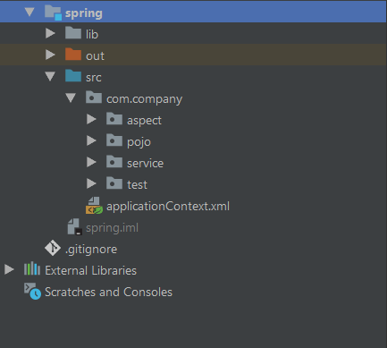
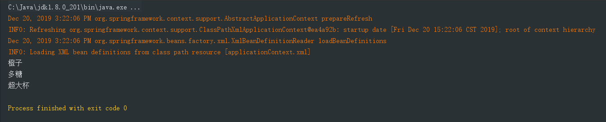

## 第一个 Spring 程序

### 新建一个项目

命名为 spring

下载 Spring 的 jar 包, 放到 spring/lib 目录下, 添加到 Module Library 

完整的目录结构如下图: (下边来一步步的来做)

.


### 在 src 目录下创建 com.company.pojo 包

新建一个 Source 类

```java
package com.company.pojo;

public class Source {
    private String fruit;  // 水果类型
    private String sugar;  // 糖分描述
    private String size;  // 大小杯

	/* getter and setter */
}
```


### 在 src 目录下新建一个 applicationContext.xml 文件

通过 xml 文件配置的方式装配我们的 bean

```xml
<?xml version="1.0" encoding="UTF-8"?>
<beans xmlns="http://www.springframework.org/schema/beans"
       xmlns:xsi="http://www.w3.org/2001/XMLSchema-instance"
       xsi:schemaLocation="http://www.springframework.org/schema/beans
        http://www.springframework.org/schema/beans/spring-beans.xsd">

    <bean name="source" class="com.company.pojo.Source">
        <property name="fruit" value="橙子"/>
        <property name="sugar" value="多糖"/>
        <property name="size" value="超大杯"/>
    </bean>
</beans>
```


### 在 src 目录下新建 test 目录, 用来写单元测试

创建 TestSpring 类, 编写 test 方法

```java
package com.company.test;

import org.junit.Test;
import org.springframework.context.ApplicationContext;
import org.springframework.context.support.ClassPathXmlApplicationContext;
import com.company.pojo.Source;

public class TestSpring {
    @Test
    public void test(){
        ApplicationContext context = new ClassPathXmlApplicationContext(
                new String[]{"applicationContext.xml"}
        );

        // 反转控制
        Source source = (Source) context.getBean("source");  // 强转类型
        System.out.println(source.getFruit());
        System.out.println(source.getSugar());
        System.out.println(source.getSize());
    }
}
```

运行单元测试, 可以正常拿到 xml 中配置的 bean



总结: 传统的方式, 通过 new 关键字主动创建一个对象, IOC 方式, 对象的生命周期由 Spring 来管理, 直接从 Spring 那里去获取一个对象, 就是控制权本来在自己手里, 交给了 Spring 