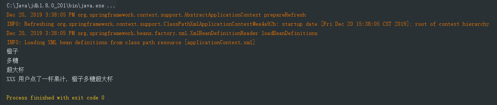

## DI : Dependency Injection (依赖注入)

指 Spring 创建对象的过程中, 将对象依赖属性( 简单值, 集合, 对象 ), 通过配置赋值给对象


### 继续前边的 Spring 程序

在 pojo 包下创建 JuiceMaker 类

```java
package com.company.pojo;

public class JuiceMaker {
    private Source source;

    public void makeJuice(){
        String info = "XXX 用户点了一杯果汁, "  +  this.source.getFruit() + this.source.getSugar() + this.source.getSize();
        System.out.println(info);
    }
	/* getter and setter */
}
```


### 在 xml 文件中配置  JuiceMaker 对象

这里要使用 ref 来注入 java bean 对象

```xml
<?xml version="1.0" encoding="UTF-8"?>
<beans xmlns="http://www.springframework.org/schema/beans"
       xmlns:xsi="http://www.w3.org/2001/XMLSchema-instance"
       xsi:schemaLocation="http://www.springframework.org/schema/beans
        http://www.springframework.org/schema/beans/spring-beans.xsd">

    <bean name="source" class="com.company.pojo.Source">
        <property name="fruit" value="橙子"/>
        <property name="sugar" value="多糖"/>
        <property name="size" value="超大杯"/>
    </bean>

    <bean name="juickMaker" class="com.company.pojo.JuiceMaker">
        <property name="source"  ref="source" />
    </bean>
</beans>

```


### 在 TestSpring 类中修改 test 方法

```java
package com.company.test;

import org.junit.Test;
import com.company.pojo.JuiceMaker;
import org.springframework.context.ApplicationContext;
import org.springframework.context.support.ClassPathXmlApplicationContext;
import com.company.pojo.Source;

public class TestSpring {
    @Test
    public void test(){
        ApplicationContext context = new ClassPathXmlApplicationContext(
                new String[]{"applicationContext.xml"}
        );

        // 反转控制
        Source source = (Source) context.getBean("source");  // 强转类型
        System.out.println(source.getFruit());
        System.out.println(source.getSugar());
        System.out.println(source.getSize());

        // 依赖注入
        JuiceMaker jm = (JuiceMaker) context.getBean("juickMaker");
        jm.makeJuice();
    }
}
```

运行测试代码



总结: IOC 和 DI 其实是同一个概念的不同角度描述的, DI 相对于 IOC 而言, 明确描述了"被注入 java bean 对象是依赖 IOC 容器中配置的对象"


###### 完 ~

