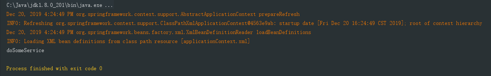
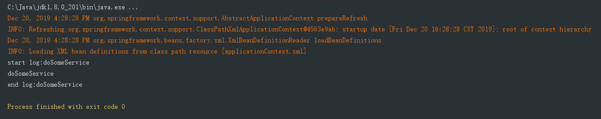

## Spring AOP

### AOP: 即 Aspect Oriented Program 面向切面编程

如果说 IOC 是 Spring 的核心, 那么面向切面编程就是 Spring 最为重要的一个功能之一了, 在数据库事务中, 切面编程被广泛应用.

首先, 在面向切面编程的思想里边, 把功能分为核心业务功能 和 周边功能

- 核心功能: 比如登录, 增加数据, 查询数据, 删除数据 都叫做核心业务
- 周边功能: 比如性能统计, 日志, 事务管理等

周边功能在 Spring 的面向切面编程 AOP 里边, 即被定义为切面功能

在面向切面编程的思想中, 核心功能和切面功能分别独立开发, 然后把核心功能和切面功能"编织"在一起, 这就叫 AOP


### AOP 的目的

AOP 能够将那些与业务无关, 却为业务模块所共同调用的逻辑或责任 ( 例如事务处理, 日志管理, 权限控制等 ) 封装起来, 便于减少系统的重复代码, 减低模块间的耦合度, 并有利于未来的可扩展性 和 可维护性.


### AOP 当中的概念

1. 切入点 (Pointcut): 在哪些类, 哪些方法上切入 (where)
2. 通知 (Advice): 在方法执行的什么时间 (when: 方法前/方法后/方法前后) 做什么 (what: 增强的功能)
3. 切面 (Aspect): 切面等于切入点 + 通知, 通俗点就是: 在什么时机, 什么地方, 做什么增强?
4. 织入 (Weaving): 把切面加入到对象, 并创建出代理对象的过程 (由 Spring 来完成)


### AOP 编程

在 com.company.service 包下创建 ProductService 类

```java
package com.company.service;

public class ProductService {
    public void doSomeService(){
        System.out.println("doSomeService");
    }
}
```

在 xml 文件中装配 bean

```xml
<bean name="productService" class="com.company.service.ProductService"/>
```

在 TestSpring 类中编写一个新的测试方法: testDoSomeService

```java
@Test
public void testDoSomeService(){
    ApplicationContext context = new ClassPathXmlApplicationContext(
        new String[]{"applicationContext.xml"}
    );

    ProductService ps = (ProductService) context.getBean("productService");
    ps.doSomeService();
}
```

运行单元测试: 



在 com.company.aspect 包下准备日志切面类 LoggerAspect

```java
package com.company.aspect;

import org.aspectj.lang.ProceedingJoinPoint;

public class LoggerAspect {
    public Object log(ProceedingJoinPoint joinPoint) throws Throwable {
        System.out.println("start log:" + joinPoint.getSignature().getName());
        Object object = joinPoint.proceed();
        System.out.println("end log:" + joinPoint.getSignature().getName());
        return object;
    }
}
```

在 xml 文件中声明业务对象和日志切面:

```xml
<?xml version="1.0" encoding="UTF-8"?>
<beans xmlns="http://www.springframework.org/schema/beans"
       xmlns:xsi="http://www.w3.org/2001/XMLSchema-instance"
       xmlns:aop="http://www.springframework.org/schema/aop"
       xmlns:tx="http://www.springframework.org/schema/tx"
       xmlns:context="http://www.springframework.org/schema/context"
       xsi:schemaLocation=" http://www.springframework.org/schema/beans
       http://www.springframework.org/schema/beans/spring-beans-3.0.xsd
       http://www.springframework.org/schema/aop
       http://www.springframework.org/schema/aop/spring-aop-3.0.xsd
       http://www.springframework.org/schema/tx
       http://www.springframework.org/schema/tx/spring-tx-3.0.xsd
       http://www.springframework.org/schema/context
       http://www.springframework.org/schema/context/spring-context-3.0.xsd">

    <bean name="source" class="com.company.pojo.Source">
        <property name="fruit" value="橙子"/>
        <property name="sugar" value="多糖"/>
        <property name="size" value="超大杯"/>
    </bean>

    <bean name="juickMaker" class="com.company.pojo.JuiceMaker">
        <property name="source"  ref="source" />

    </bean>

    <bean name="productService" class="com.company.service.ProductService"/>
    <bean id="loggerAspect" class="com.company.aspect.LoggerAspect"/>

     <!--配置AOP -->
    <aop:config>
        <!-- where：在哪些地方（包.类.方法）做增加 -->
        <aop:pointcut id="loggerCutpoint" expression="execution(* com.company.service.ProductService.*(..)) "/>

        <!-- what:做什么增强 -->
        <aop:aspect id="logAspect" ref="loggerAspect">
            <!-- when:在什么时机（方法前/后/前后） -->
            <aop:around pointcut-ref="loggerCutpoint" method="log"/>
        </aop:aspect>
    </aop:config>
</beans>
```

再次运行 testDoSomeService 单元测试, 代码没有改变, 但是业务方法运行之前和运行之后, 都分别输出了日志信息




###### 完 ~

