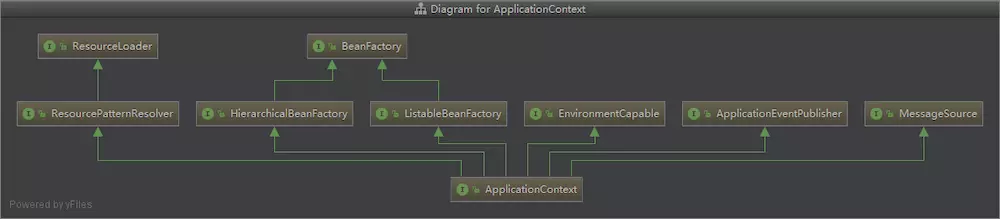
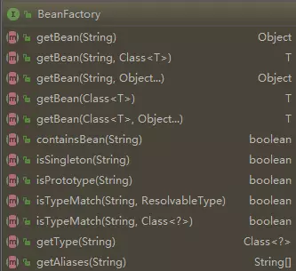

## 反转控制 IOC 详解

主动创建的模式中, 责任归于开发者, 而在被动的模式下, 责任归于 IOC 容器, **基于这样的被动形式，我们就说对象被控制反转了. (也可以说是反转了控制)**


### Spring IOC 容器

Spring 会提供 IOC 容器来管理和容纳我们所开发的各种各样的 bean, 并且我们可以从中获取各种发布在 Spring IOC 容器里的 bean, 并且**通过描述**可以得到它


### Spring IOC 容器的设计

Spring IOC 容器的设计主要是基于以下两个接口

1. BeanFactory
2. ApplicationContext

其中 ApplicationContext 是 BeanFactory 的子接口之一, 换句话说: BeanFactory 是 Spring IOC 容器所定义的**最底层接口**, 而 ApplicationContext 是其最高级接口之一, 并对 BeanFactory 功能做了许多的扩展, 所以在绝大部分的工作场景下, 都会使用 ApplicationContext 作为 Spring IOC 容器.



BeanFactory 和 ApplicationContext 的区别 (了解)

BeanFactory 只提供了最简单的 IOC 功能, 负责配置, 创建和管理 Bean

ApplicationContext 继承了 BeanFactory, 拥有了基本的 IOC 功能之外, 还提供了以下功能:

1. 支持国际化
2. 支持消息机制
3. 支持统一的资源加载
4. 支持 AOP 功能


### BeanFactory

BeanFactory 位于设计的最底层, 它提供了 Spring IOC 最底层的设计, 所有关于 Spring IOC 的容器将会遵守它定义的方法, 为此, 我们先看下该类中提供了哪些方法: 



由于这个接口的重要性, 所以有必要在这里做一下简单的说明: 

- getBean : 对应了多个重载的方法来获取配置给 Spring IOC 容器的 Bean

  1. 按照**类型**获取 bean (要求在 Spring 中只配置了一个这种类型的实例, 否则报错, Spring 不知道该获取哪一个...)

     ```java
     bean = (Bean) factory.getBean(Bean.class)
     ```

  2. 按照**名称**获取 bean (这种方法不太安全, IDE 不会检查其安全性)

     ```java
     bean = (Bean) factory.getBean("beanName")
     ```

  3. 按照**名称** 和 **类型** 获取 Bean (**推荐使用**)

     ```java
     bean = (Bean) factory.getBean("beanName", Bean.class)
     ```

  

- isSingleton : 用于判断是否单例, 如果判断为真 **(默认为 true)**, 其意思是该 Bean 在容器中是作为一个唯一的单例存在的

- isPrototype : 与 isSingleton 相反, 如果判断为真 **(默认为false)**, 意思是从容器中获取 Bean, 容器就为你生成一个新的实例

  

- isTypeMatch : 关于 type 的匹配, 这个一个按 java 类型匹配的方式

  

- getAliases : 获取别名的方法


### ApplicationContext

根据上边的类关系继承图, 可以看到 ApplicationContext 接口扩展了许许多多的接口, 因此它的功能特别强大, 所以在实际应用中常常会使用到的是 Application 接口

在前面的代码中, 我们用到的是 ApplicationContext 的子类 : `ClassPathXmlApplicationContext`

复习一下: 

1. 先在 src 目录下创建一个 bean.xml 文件, 键入内容如下: 

   ```xml
   <?xml version="1.0" encoding="UTF-8"?> 
   <beans xmlns="http://www.springframework.org/schema/beans" 
          xmlns:xsi="http://www.w3.org/2001/XMLSchema-instance" 
          xsi:schemaLocation="http://www.springframework.org/schema/beans 
          http://www.springframework.org/schema/beans/spring-beans.xsd"> 
       <!-- 通过 xml 方式装配 bean --> 
       <bean name="source" class="com.company.pojo.Source"> 
           <property name="fruit" value="橙汁"/> 
           <property name="sugar" value="半糖"/> 
           <property name="size" value="大杯"/> 
       </bean> 
   </beans>
   ```

2. 定义了 bean 之后, 在 Spring IOC 容器在初始化的时候就可以找到并使用它们, 使用 ApplicationContext 的实现类 ClassPathXmlApplicationContext 去初始化 Spring IOC 容器, 然后开发者就可以通过 IOC 容器来获取资源了

   ```java
   @Test
   public void testBean(){
       ApplicationContext context = new ClassPathXmlApplicationContext("bean.xml");
       Source source = (Source) context.getBean("source", Source.class);
       System.out.println(source.getFruit());
       System.out.println(source.getSugar());
       System.out.println(source.getSize());
   }
   ```


### ApplicationContext 常见实现类

1. `ClassPathXmlApplicationContext` : 读取 classpath 中的资源

   ```java
   ApplicationContext ctx = new ClassPathXmlApplicationContext("applicationContext.xml");
   ```

2. `FileSystemXmlApplicationContext` : 读取指定路径的资源

   ```java
   ApplicationContext ctx = new FileSystemXmlApplicationContext("c:/applicationContext.xml");
   ```

3. `XmlWebApplicationContext` : 需要在Web的环境下才可以运行

   ```java
   XmlWebApplicationContext ctx = new XmlWebApplicationContext(); // 这时并没有初始化容器
   ctx.setServletContext(servletContext); // 需要指定ServletContext对象
   ctx.setConfigLocation("/WEB-INF/applicationContext.xml"); // 指定配置文件路径，开头的斜线表示Web应用的根目录
   ctx.refresh(); // 初始化容器
   ```

   

### Spring IOC  容器的初始化和依赖注入

虽然 Spring IoC 容器的生成十分的复杂, 但是大体了解一下 Spring IOC 初始化的过程还是必要的, 这对于理解 Spring 的一系列行为是很有帮助的.

**注意: ** Bean 的定义和初始化在 Spring IOC 容器是两大步骤, 它是先定义, 然后初始化和依赖注入的。

Bean 的定义分为 3 步:

1. Resource 定位
   Spring IOC 容器先根据开发者的配置, 进行资源的定位, 在 Spring 的开发中, **通过 XML 或者注解都是十分常见的方式**, 定位的内容是由开发者提供的;
2. BeanDefinition 的载入
   这个时候只是将 Resource 定位到的信息, 保存到 Bean 定义 (BeanDefinition) 中, 此时并不会创建 Bean 的实例;
3. BeanDefinition 的注册
   这个过程就是将 BeanDefinition 的信息发布到 Spring IOC 容器中, 此时仍然没有对应的 Bean 的实例;

做完了以上 3 步, Bean 就在 Spring IOC 容器中被定义了, 而没有被初始化, 更没有完成依赖注入, 也就是没有注入其配置的资源给 Bean, 那么它还不能完全使用;

对于初始化和依赖注入, Spring Bean 还有一个配置选项——**lazy-init**, 其含义就是**是否初始化 Spring Bean**, 在没有任何配置的情况下, 它的默认值为 default, 实际值为 false, 也就是 **Spring IOC 默认会自动初始化 Bean**, 如果将其设置为 true, 那么只有当我们使用 Spring IOC 容器的 getBean 方法获取它时, 它才会进行 Bean 的初始化, 完成依赖注入.


### IOC 是如何实现的

最后简单说说 IOC 是如何实现的, 想象一下如果我们自己来实现这个依赖注入的功能, 我们怎么来做? 无外乎: 

1. 读取注解或者配置文件, 看看 JuiceMaker 依赖的是哪个Source, 拿到类名
2. 使用反射的API, 基于类名实例化对应的对象实例
3. 将对象实例化, 通过构造函数或者 setter, 传递给 JuiceMaker

我们发现其实自己来实现也不是很难, Spring实际也就是这么做的, 这么看的话其实 IOC 就是一个工厂模式的升级版! 当然要做一个成熟的 IOC框架, 还是非常多细致的工作要做, Spring不仅提供了一个已经成为业界标准的 Java IOC框架, 还提供了更多强大的功能, 所以大家就别去造轮子啦! 希望了解 IOC 更多实现细节不妨通过学习 Spring 的源码来加深理解!


###### 完 ~