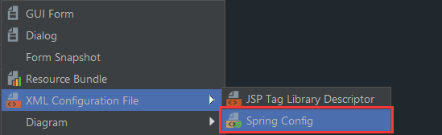

## 装配 Spring Bean 详解

### 装配 Bean 的概述

前边已经介绍了 Spring IOC 的理念和设计, 这里将说明的是如何将自己开发的 Bean 装配到 Spring IOC 容器中.

大部分场景下, 我们都会使用 ApplicationContext 的具体实现类, 因为对应的 Spring IOC 容器功能相对强大, 而在 Spring 中提供了 3 种方法进行配置: 

1. 在 XML 文件中显示配置 (前边已做过演示)
2. 在 Java 的接口和类中实现配置
3. 隐式 Bean 的发现机制和自动装配原则


### 方式选择的原则

在现实的工作中, 这 3 种方式都会被用到, 并且在学习和工作之中常常混合使用, 所以这里给出一些关于这 3 种优先级的建议: 

1. 最优先: 通过隐式 Bean 的发现机制 和 自动装配的原则

   基于约定由于配置的原则, 这种方式应该是最优先的

   **好处: **减少程序开发者的决定权, 简单而不失灵活

   

2. 其次: Java 接口和类中实现配置

   在没有办法使用自动装配原则的情况下优先考虑此方式

   **好处: **避免 XML 配置的泛滥, 也更为容易

   **典型场景: **一个父类有多个子类, 比如学生类有两个子类, 一个男学生类和女学生类, 通过 IOC 容器初始化一个学生类, 容器将无法知道使用哪个子类去初始化, 这个时候可以用 Java 注解去指定配置

   

3. 最后: XML 方式配置

   在上述方式都无法使用的情况下, 那么也只能选择 XML 配置的方式

   **好处: **简单易懂, 特别是对于初学者

   **典型场景: **当使用第三方类的时候, 有些类并不是我们开发的, 我们无法修改代码, 这个时候就只能通过 XML 的方式进行配置使用了.

   

### 通过 XML 配置装配 Bean

首选需要引入对应的 XML 模式 (XSD) 文件, 这些文件会定义配置 Spring Bean 的一些元素, 当我们在 IDEA 中创建 XML 文件时, 会有友好的提示:



一个定义好的 XML 配置文件如下 (只是一个格式文件, 引入了 beans 的标签, 引入了 xsd 文件, 它是一个根元素, 这样它所定义的元素将可以定义对应的 Spring Bean)

```xml
<?xml version="1.0" encoding="UTF-8"?>
<beans xmlns="http://www.springframework.org/schema/beans"
       xmlns:xsi="http://www.w3.org/2001/XMLSchema-instance"
       xsi:schemaLocation="http://www.springframework.org/schema/beans http://www.springframework.org/schema/beans/spring-beans.xsd">

</beans>
```

先来一个最简单的装配: 

```xml
<bean id="s1" class="com.company.pojo.Student">
    <property name="name" value="johny"/>
</bean>
```

说明一下: (了解即可)

1. id 属性是 Spring 能找到当前 Bean 的一个依赖的编号, 遵守 XML 语法的 ID 唯一性约束, 必须以字母开头, 可以使用字母, 数字, 连字符, 下划线, 句号, 冒号, 不能以 / 开头, 不过 id 属性不是一个必需的属性; name 属性也可以定义 bean 元素的名称, 能以逗号或空格隔开起多个别名, 并且可以使用很多的特殊字符, 比如在 Spring 和 Spring MVC 的整合中, 就得使用 name 属性来定义 bean 的名称, 并且使用 / 开头.
2. 从 Spring 3.1 开始, id 属性也可以是 String 类型了, 也就是说 id 属性也可以使用 / 开头, 而 bean 元素的 id 的唯一性由IOC 容器负责检查, 如果 id 和 name 属性都没有声明的话, 那么 Spring 将会采用 **全限定名** 的格式生成编号, 例如这里,  如果没有声明 id = "s1" , 那么 Spring 为其生成的编号就是 "com.company.pojo.Student#0", 当它第二次声明 bean 时, 编号就是 "com.company.pojo.Student#1", 以此类推.
3. class 属性显然是一个类的全限定名.
4. property 标签, 其中 name 属性定义的是类中对象属性的名称, 而 value 则是它的值.


这样 XML 的配置方式非常简单, 但有时需要注入一些自定义的类, 比如前边生产果汁的例子, JuickMaker 需要用户提供原料信息才能完成 juice 的制作: 

这里先定义了一个 name 为 Source 的 Bean, 然后再制造器中通过 ref 属性去引用对应的 Bean, 而 source 正是之前定义的 Bean 的 name, 这样就可以相互引用了

**注入对象:** 使用 ref 属性

```xml
<!-- 配置 srouce 原料 -->
<bean name="source" class="com.company.pojo.Source">
    <property name="fruit" value="橙子"/>
    <property name="sugar" value="多糖"/>
    <property name="size" value="超大杯"/>
</bean>

<bean name="juickMaker" class="com.company.pojo.JuiceMaker">
    <!-- 注入上面配置的id为srouce的Srouce对象 -->
    <property name="source"  ref="source" />
</bean>>
```


### 通过 XML 配置装配 集合

略


###### 完 ~