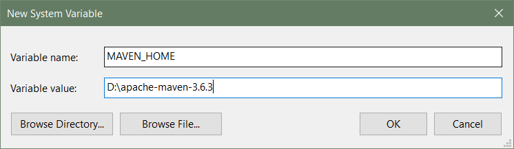
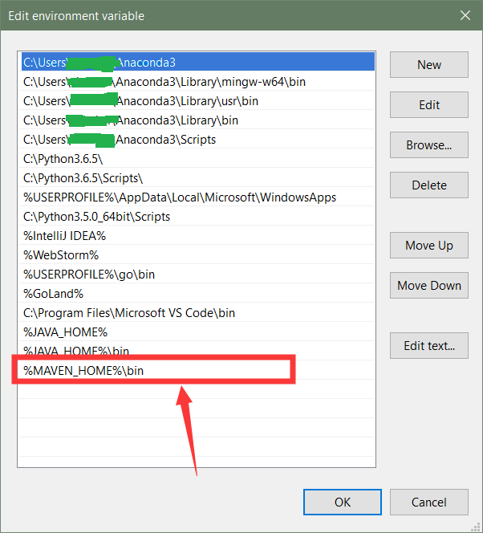
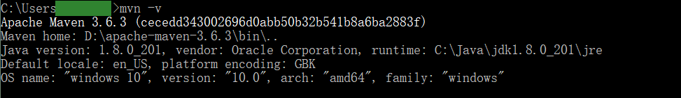

## Maven 安装

### 下载地址

https://maven.apache.org/download.cgi

下载完成后, 解压即可


### 配置环境变量

新增环境变量

.

在 Path 变量中添加 %MAVEN_HOME%\bin

.

安装验证




### 修改 conf/setting.xml 配置文件

在 mirrors 中添加下面的内容， 使用阿里云服务器下载 jar 包，国外的下载链接太慢了， 注释不用

```xml
<!-- 阿里云仓库 -->
<mirror>
    <id>alimaven</id>
    <mirrorOf>central</mirrorOf>
    <name>aliyun maven</name>
    <url>http://maven.aliyun.com/nexus/content/repositories/central/</url>
</mirror>

<!-- 中央仓库1 -->
<mirror>
    <id>repo1</id>
    <mirrorOf>central</mirrorOf>
    <name>Human Readable Name for this Mirror.</name>
    <url>http://repo1.maven.org/maven2/</url>
</mirror>

<!-- 中央仓库2 -->
<mirror>
    <id>repo2</id>
    <mirrorOf>central</mirrorOf>
    <name>Human Readable Name for this Mirror.</name>
    <url>http://repo2.maven.org/maven2/</url>
</mirror>
```


指定本地仓库的位置

```xml
<!-- localRepository
   | The path to the local repository maven will use to store artifacts.
   |
   | Default: ${user.home}/.m2/repository
  <localRepository>/path/to/local/repo</localRepository>
  -->
<localRepository>D:\maven_repository</localRepository>
```


###### 完  ~