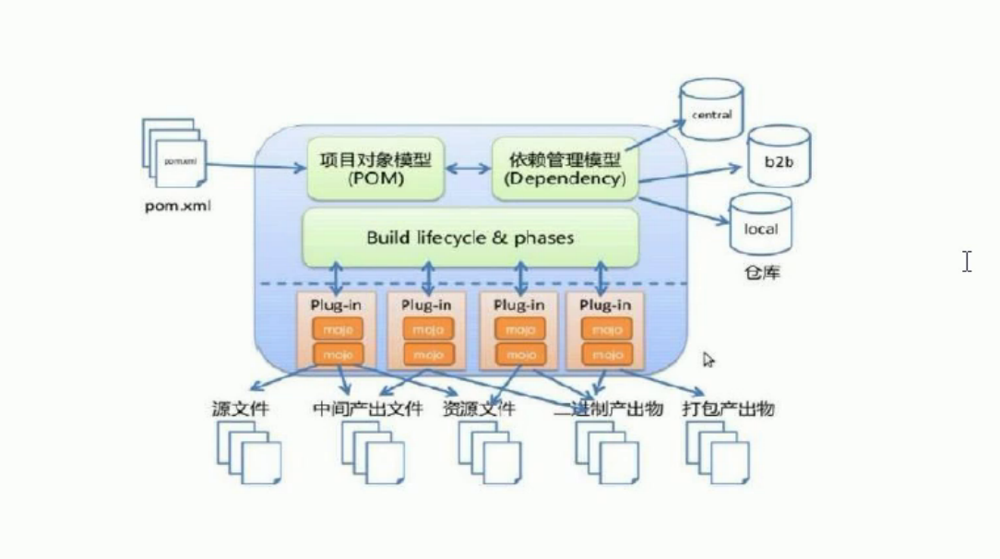
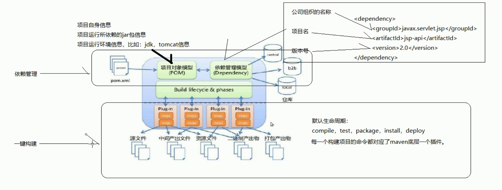

## Maven 概念模型图




### pom.xml

包含以下信息:

1. 项目自身的信息

   ```xml
   <modelVersion>4.0.0</modelVersion>
   <groupId>com.company.maven</groupId>
   <artifactId>maven-helloworld</artifactId>
   <version>0.0.1-SNAPSHOT</version>
   <packaging>war</packaging>
   <name>first maven</name>
   <description>第一个maven工程</description>  
   ```

2. 项目运行所依赖的 jar 包信息

   ```xml
   <!-- 添加servlet-api，jsp-api -->
   <dependencies>
       <dependency>
           <groupId>junit</groupId>
           <artifactId>junit</artifactId>
           <version>4.9</version>
           <scope>test</scope>
       </dependency>
       <dependency>
           <groupId>javax.servlet.jsp</groupId>
           <artifactId>jsp-api</artifactId>
           <version>2.0</version>
           <scope>provided</scope>
       </dependency>
       <dependency>
           <groupId>javax.servlet</groupId>
           <artifactId>servlet-api</artifactId>
           <version>2.5</version>
           <scope>provided</scope>
       </dependency>
   </dependencies>
   ```

3. 项目运行环境信息, 比如: jdk, tomcat 等

   ```xml
   <plugins>
       <plugin>
           <groupId>org.apache.maven.plugins</groupId>
           <artifactId>maven-compiler-plugin</artifactId>
           <configuration>
               <source>1.7</source>
               <target>1.7</target>
               <encoding>UTF-8</encoding>
           </configuration>
       </plugin>
       <plugin>
           <groupId>org.apache.tomcat.maven</groupId>
           <artifactId>tomcat7-maven-plugin</artifactId>
           <version>2.1</version>
           <configuration>
               <port>9090</port>
               <path>/mgr</path>
               <uriEncoding>UTF-8</uriEncoding>
               <server>tomcat7</server>
           </configuration>
       </plugin>
   </plugins>
   ```

   


### 概念模型图详解




