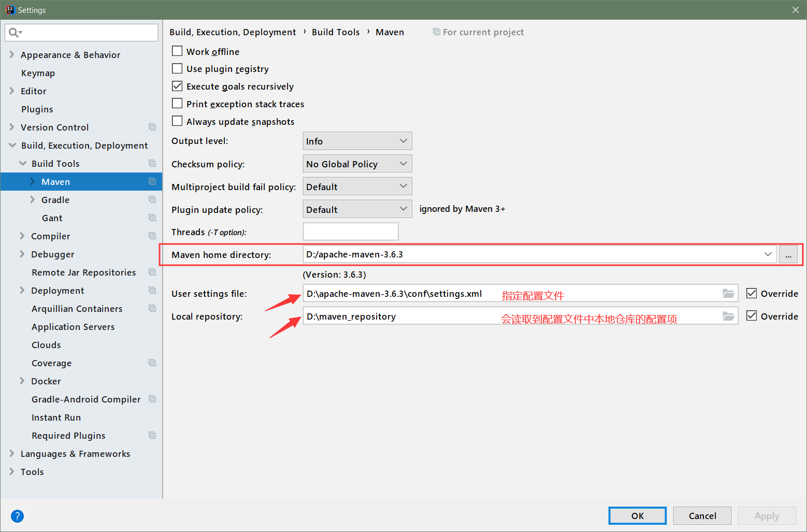
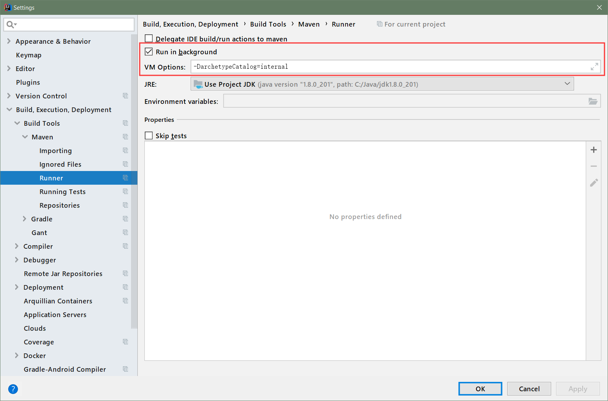

## IDEA 集成 Maven

进入设置, 搜索 maven, 配置 maven 的安装目录, 指定配置文件

在配置文件中指定本地仓库的位置:

```xml
<!-- localRepository
   | The path to the local repository maven will use to store artifacts.
   |
   | Default: ${user.home}/.m2/repository
  <localRepository>/path/to/local/repo</localRepository>
  -->
<localRepository>D:\maven_repository</localRepository>
```




### Runner

为了确保能使用已下载的本地运行环境, 还需要配置一个参数:

`-DarchetypeCatalog=internal`




###### 完 ~


