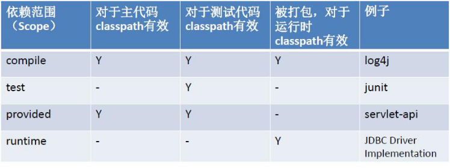

## IDEA 集成 Maven

进入设置, 搜索 maven, 配置 maven 的安装目录, 指定配置文件

在配置文件中指定本地仓库的位置:

```xml
<!-- localRepository
   | The path to the local repository maven will use to store artifacts.
   |
   | Default: ${user.home}/.m2/repository
  <localRepository>/path/to/local/repo</localRepository>
  -->
<localRepository>D:\maven_repository</localRepository>
```


### Runner

为了确保能使用已下载的本地运行环境, 还需要配置一个参数:

`-DarchetypeCatalog=internal`


### 配置 pom.xml 文件

**坐标**

在平面几何中坐标（x,y）可以标识平面中唯一的一点。在maven中坐标就是为了定位一个唯一确定的jar包。

Maven 世界拥有大量构建，我们需要找一个用来唯一标识一个构建的统一规范，拥有了统一规范，就可以把查找工作交给机器

Maven坐标主要组成(GAV) -确定一个jar在互联网位置

- groupId：定义当前Maven组织名称

- artifactId：定义实际项目名称

- version：定义当前项目的当前版本


**scope** 依赖范围 

 其中依赖范围 scope 用来控制依赖和编译，测试，运行的classpath的关系. 主要的是三种依赖关系如下：

- compile： 默认编译依赖范围。对于编译，测试，运行三种classpath都有效
- test：测试依赖范围。只对于测试classpath有效
- provided：已提供依赖范围。对于编译，测试的classpath都有效，但对于运行无效。因为由容器已经提供，例如servlet-api，补充：provided 表示以后不要打包到 war 的 lib 包中。
- runtime:运行时提供。例如:jdbc驱动


###### 完 ~


