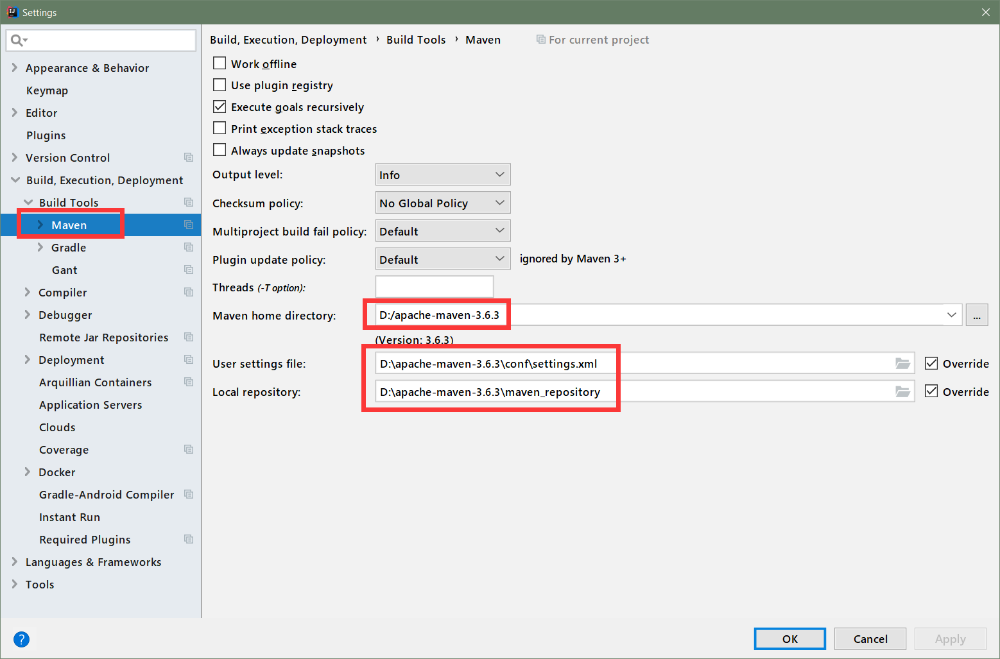

## 环境准备

### 技术贮备

1. Spring 框架知识
2. 熟练使用 Maven 进行项目构建和依赖管理
3. 开发环境 IDEA


### 开发环境

1. jdk1.8
2. maven3.x
3. Spring Boot 1.5.9.RELEASE


### MAVEN 配置

给 maven 的 settings.xml 配置文件的 profiles 标签中添加:

```xml
<profile>
	<id>jdk-1.8</id>
	<activation>
		<activeByDefault>true</activeByDefault>
		<jdk>1.8</jdk>
	</activation>

	<properties>
		<maven.compiler.source>1.8</maven.compiler.source>
		<maven.compiler.target>1.8</maven.compiler.target>
		<maven.compiler.compilerVersion>1.8</maven.compiler.compilerVersion>
	</properties>
</profile>
```


### IDEA 配置




