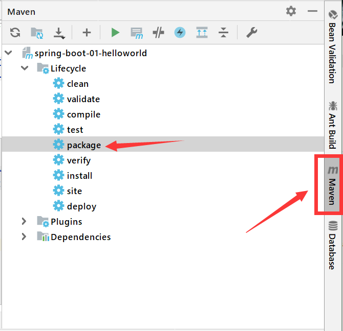

## Spring Boot 实现 Hello World

### 一个功能

1. 浏览器发送 hello 请求, 服务器接收请求并响应 Hello World


### 创建 Maven 工程

1. 在 IDEA 中创建一个 maven 工程

2. 导入依赖 (pom.xml)

   ```xml
   <parent>
       <groupId>org.springframework.boot</groupId>
       <artifactId>spring-boot-starter-parent</artifactId>
       <version>1.5.9.RELEASE</version>
   </parent>
   <dependencies>
       <dependency>
       	<groupId>org.springframework.boot</groupId>
           <artifactId>spring-boot-starter-web</artifactId>
       </dependency>
   </dependencies>
   ```


### 编码

1. 写一个主程序

   ```java
   package com.company;
   
   import org.springframework.boot.SpringApplication;
   import org.springframework.boot.autoconfigure.SpringBootApplication;
   
   /**
    * @SpringBootApplication 来标注一个主程序类, 说明这是一个 Spring Boot应用
    */
   @SpringBootApplication
   public class HelloWorldMainApplication {
       public static void main(String[] args) {
           // Spring 应用启动
           SpringApplication.run(HelloWorldMainApplication.class, args);
       }
   }
   ```

   

2. 编写相关的 Controller 和 Service

   ```java
   package com.company.controller;
   
   import org.springframework.stereotype.Controller;
   import org.springframework.web.bind.annotation.RequestMapping;
   import org.springframework.web.bind.annotation.ResponseBody;
   
   @Controller
   public class HelloController {
       @ResponseBody
       @RequestMapping("/hello")
       public String hello(){
           return "Hello World";
       }
   }
   ```

   

3. 运行主程序, 访问: http://localhost:8080/hello


### 打包, 简化部署

1. 配置依赖 (pom.xml)

   ```xml
   <!--打包成 jar 包-->
   <build>
       <plugins>
           <plugin>
               <groupId>org.springframework.boot</groupId>
               <artifactId>spring-boot-maven-plugin</artifactId>
           </plugin>
       </plugins>
   </build>>
   ```

2. 打包操作

   

3. 直接使用 java -jar 的命令运行 jar 包即可部署


### 坑

apache-maven-3.6.3 版本出现报错: 

`idea maven:Unable to create injector, see the following errors`

解决方法: 换成 3.6.1 版本, 下载地址:  [maven3.6.1](https://archive.apache.org/dist/maven/maven-3/3.6.1/binaries/ )

