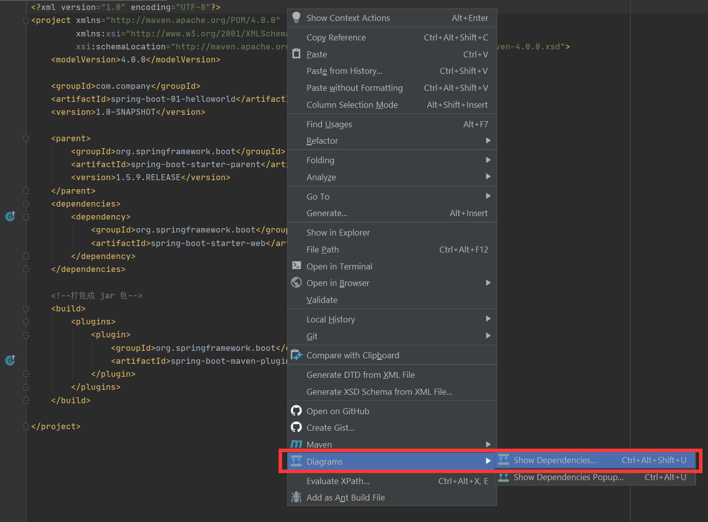
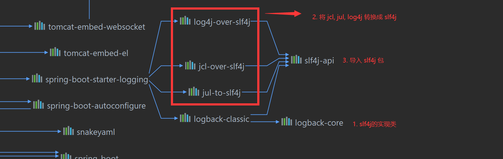
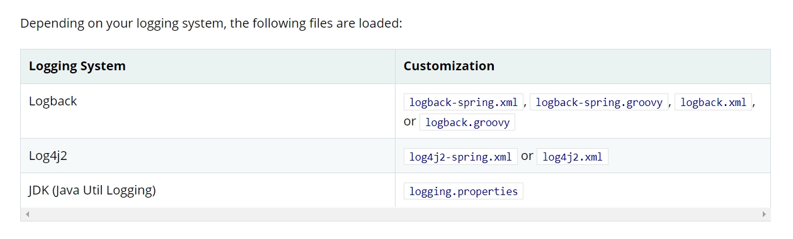

## SpringBoot使用SLF4j框架

### 底层依赖关系

idea 里边点击鼠标右键, 选择 Diagrams --> 查看





```xml
<dependency>
    <groupId>org.springframework</groupId>
    <artifactId>spring-core</artifactId>
    <exclusions>
        <exclusion>
            <groupId>commons-logging</groupId>
            <artifactId>commons-logging</artifactId>
        </exclusion>
    </exclusions>
</dependency>
```

总结: 

+ SpringBoot 底层是 slf4j + logback 的方式进行日志记录
+ 排除了 commons-logging 日志框架 (Spring 默认日志框架)
+ SpringBoot也把其它的日志都替换成了 slf4j (导入了中间替换包, 覆盖包)


### 其他问题

1. 如果我们要引入其他框架, 一定要把这个框架的默认日志依赖移除掉; 

```xml
<exclusions>
    <exclusion>
        <groupId>commons-logging</groupId>
        <artifactId>commons-logging</artifactId>
    </exclusion>
</exclusions>
```


### 日志配置参数

在配置文件 properties / yml 文件中配置

1. 设置日志级别

   ```yml
   #设置 com.company 包下的日志级别
   logging:
     level:
       com:
         company: debug
   ```

   

2. 设置日志路径 和 日志文件名称

   + 如果都没有指定: 只在控制台输出日志

   + 只指定路径(logging.path): 输出到指定目录下的 spring.log 文件中logging.path 已过时

   + 只指定文件名(logging.file): 输出到项目根目录下的 my.log(指定文件名) 文件中

     **logging.file 也可以设置路径,  所以一般只需要设置 logging.file 就可以了**

     ```yml
     #设置 com.company 包下的日志级别; 日志的 目录和文件名
     logging:
       file:
         name: F:\aitraffic.log
     ```

   

3. 设置日志的输出格式

   ```yml
   logging:
     pattern:
       #控制台输出的日志格式
       console: "%date{yyyy-MM-dd HH:mm:ss.SSS} [%thread] %-5level %logger{50} %msg%n"
       #文件中输出的日志格式
       file: "%date{yyyy-MM-dd HH:mm:ss.SSS}=[%thread]=%-5level=%logger{50}=%msg%n"
   ```

   具体的日志参数可以在网上查资料获取


### 指定日志配置文件

官方文档图示:



1. 如果使用 logback, 那么就在 resources 目录下的 logback-spring.xml 或 logback.xml 文件中进行配置即可

2. 推荐使用 logback-spring.xml 配置文件

   + logback.xml: 直接就被日志框架识别了

   + logback-spring.xml: 日志框架就不直接加载日志的配置项, 由 SpringBoot 解析日志配置, 可以使用 SpringBoot 的高级 Profile 功能

     ```xml
     <!--开发环境下的输出格式-->
     <springProfile name="dev">
         <pattern>"%d{yyyy-MM-dd HH:mm:ss.SSS} [%thread] %-5level %logger{50} %msg%n"</pattern>
     </springProfile>
     <!--非开发环境下的输出格式-->
     <springProfile name="!dev">
         <pattern>"%d{yyyy-MM-dd HH:mm:ss.SSS} == [%thread] == %-5level == %logger{50} == %msg%n"</pattern>
     </springProfile>
     ```

     


###### 完